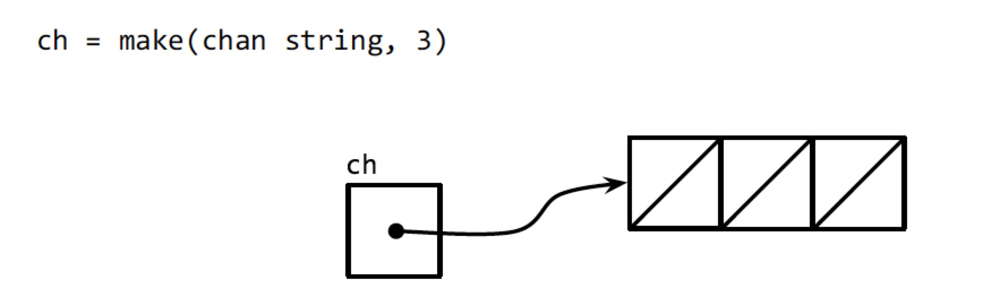
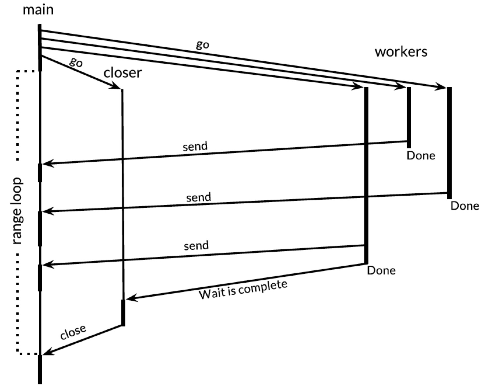

# Sum
- 往关闭的通道发送数据会 panic；从关闭的通道读取数据，读完已经发送到该通道的数据后，any receive operations **thereafter** complete immediately and yield the **zero value of the channel's element type**
- Needn't close every channel when you've finished with it. It's only necessary to close a channel when it's important to **tell the receiving goroutines that all data have been sent**. A channel that the garbage collector determines to be unreachable will have its resources **reclaimed** whether or not it is closed
- Unlike garbage variables, **leaked goroutines are not automatically collected**, so it's important to make sure that **goroutines terminate themselves** when no longer needed
- A `select` with no cases, `select{}`, waits forever
- Because **send and receive on a nil channel block forever** (such case cannot not proceed and perform the communication), a case in a select statement whose channel is nil is **never selected**
- A `select` may have a `default`, which specifies what to do when none of the other communications can proceed immediately (可用于 non-blocking communication)
- `sync.WaitGroup` 用来控制不确定数目的协程都结束
- counting semaphore 限制并发数量
- 关闭一个 nil 的通道，使得（多个） select 里的从该 nil 通道读值的 case 可以被执行，起到**广播**（取消）操作的作用（`ch8/du4`）
    - 取消单个协程可以往 select 的 case 发送信号（`ch8/countdown3`）
- nil channel

    ```go
    var a chan int
	fmt.Println(a == nil) // true
    close(a) // panic: close of nil channel
    
    b := make(chan int)
    fmt.Println(b == nil) // false
    close(b) // ok
    ```

    - 引用类型的 zero value 指只做了声明，未实际分配内存，该变量指向的地址是 nil，此时 `== nil` 判断为真；分配内存后 `== nil` 判断就为假
# A tour of Go
- A goroutine is a lightweight thread managed by the Go runtime
- `go f(x, y, z)` starts a new goroutine running `f(x, y, z)`
- The evaluation of `f`, `x`, `y`, `z` happens in the current goroutine and the execution of `f` happens in the new goroutine
- Goroutines run in the **same address space**, so access to shared memory must be synchronized
- Channels are a **typed conduit** through which you can send and receive values with the channel operator `<-`

    ```go
    ch <- v     // send v to channel ch
    v := <-ch   // receive from ch, and assign value to v
    ```

    - The data flows in the direction of the arrow
- Like maps and slices, channels must be created before use

    ```go
    ch := make(chan int)
    ```

- By default, sends and receives block until the other side is ready. This allows goroutines to synchronize without explicit locks or condition variables

    ```go
    func sum(s []int, c chan int) {
        sum := 0
        for _, v := range s {
            sum += v
        }
        c <- sum
    }
    func main() {
        s := []int{7, 2, 8, -9, 4, 0}
        c := make(chan int)
        go sum(s[:len(s) / 2], c)
        go sum(s[len(s) / 2:], c)
        x, y := <-c, <-c
        fmt.Println(x, y, x+y)
    }
    ```

- Channels can be buffered

    ```go
    // provide the buffer length as the second parameter
    ch := make(chan int, 100)
    ```

- Sends to a buffered channel block only when the buffer is full
- Receivers block when the buffer is empty
- A sender can `close` a channel to indicate that no more values will be sent. Receiver can test whether a channel has been closed by assigning a second parameter to the receiver expression

    ```go
    v, ok := <-ch
    ```

    - `ok` is `false` if there are no more values to receive and the channel is **closed**
- Only the sender should close a channel, never the receiver
- Sending on a closed channel will cause a panic
- The loop `for i := range c` **receive** values from the channel repeatedly until it is **closed**
- Channels aren't like files; you don't usually need to close them. Closing is only necessary when the receiver must be told there're no more values coming, such as to terminate a `range` loop

    ```go
    func fibonacci(n int, c chan int) {
        x, y := 0, 1
        for i := 0; i < n; i++ {
            c <- x
            x, y = y, x+y
        }
        close(c)
    }
    func main() {
        c := make(chan int, 10)
        go fibonacci(cap(c), c)
        for i := range c {
            fmt.Println(i)
        }
    }
    ```

- The `select` statement lets a goroutine wait on multiple communication operations
- A `select` blocks until one of its cases can run, then it executes that case. It chooses one at **random** if multiple are ready

    ```go
    func fibonacci(c, quit chan int) {
        x, y := 0, 1
        // 无限循环，直至 return 逻辑被执行
        for {
            // 协程间交互
            select {
            // 1. case 是 x 写入 channel c 这一操作；阻塞直至 c 被读取
            case c <- x:
                x, y = y, x+y
            case <-quit:
                fmt.Println("quit")
                return
            }
        }
    }
    func main() {
        c := make(chan int)
        quit := make(chan int)
        go func() {
            for i := 0; i < 10; i++ {
                // 2. 从 channel c 中读取 10 个
                fmt.Println(<-c)
            }
            
            quit <- 0
        }()
        fibonacci(c, quit)
    }
    ```

- The `default` case in a `select` is run if no other case is ready
- Use a `default` case to try and send or receive without blocking

    ```go
    func main() {
        tick := time.Tick(100 * time.Millisecond)
        boom := time.After(500 * time.Millisecond)
        for {
            select {
            case <-tick:
                fmt.Println("tick.")
            case <-boom:
                fmt.Println("BOOM!")
                return
            default:
                fmt.Println("   .")
                time.Sleep(50 * time.Millisecond)
            }
        }
    }
    ```

- [ ] https://tour.golang.org/concurrency/8?a=1
- The concept of only one goroutine can access a variable at a time to avoid conflicts is called *mutual exclusion*. The conventional name for the data structure that provides it is *mutex*
- Go's standard library provides mutual exclusion with `sync.Mutex` and its 2 methods `Lock` and `Unlock`

    ```go
    type SafeCounter struct {
        v map[string]int
        mux sync.Mutex
    }
    func (c *SafeCounter) Inc(key string) {
        c.mux.Lock()
        // lock so only one goroutine at a time can access the map c.v
        c.v[key]++
        c.mux.Unlock()
    }
    func (c *SafeCounter) Value(key string) int {
        // lock so that only one goroutine at a time can access the map c.v
        c.mux.Lock()
        // use defer to make sure the mutex wil be unlocked
        defer c.mux.Unlock()
        return c.v[key]
    }

    c := SafeCounter{v : make(map[string]int)}
    for i := 0; i < 1000; i++ {
        go c.Inc("somekey")
    }
    time.Sleep(time.Second)
    fmt.Println(c.Value("somekey"))
    ```

# TL;DR
- A channel is a **communication mechanism** that allows one goroutine to pass values of a specified type to another goroutine
- `main` runs in a goroutine and the `go` statement creates additional goroutines
- When one goroutine attempts a send or receive **on a channel**, it blocks until another goroutine attempts the corresponding receive or send operation, at which point the value is transferred and both goroutines proceed
- Goroutines and channels support *communicating sequential process* (CSP) - a model of concurrency in which values are passed between independent activities (goroutines) but variables are for most part confined to a single activity
# Goroutines
- In Go, each concurrently executing activity is called a *goroutine*
    - If you have used operating system threads or threads in other programming languages, then you can assume for now that a goroutine is similar to a thread. The difference between threads and goroutines are essentially quantitative, not qualitative
- When a program starts, its only goroutine is the one that calls the `main` function (called *main goroutine*)
- New goroutine are created by the `go` statement (new goroutine calls other functions)
    - Syntactically, a `go` statement is an ordinary function or method call prefixed by the keyword `go`
    - A `go` statement causes the function to be called in a newly created goroutine. The `go` keyword itself completes immediately

        ```go
        f() // wait for f() to return
        go f() // create a new goroutine that calls f(); won't wait
        ```

- When the `main` function returns, **all** goroutines are abruptly terminated and the **program exists**. Other than by returning from `main` or existing the program, there is **no programmatic way for one goroutine to stop another**
    - But there are ways to communicate with a goroutine to **request that it stop itself**
## Example: concurrent clock server
- `time.Time.Format` provides a way to format date and time information by example. Its argument is a template indicating how to format a reference time, specially `Mon Jan 2 03:04:05PM 2006 UTC-0700`. The reference time has 8 components. Any collection of them can appear in the `Format` string in **any order** and in **a number of formats**. The selected components of will be displayed in the selected formats
    - The `time` package defines templates for many standard time formats， such as `time.RFC1123`
    - The same mechanism is used in reverse when passing a time using `time.Parse`
## Example: concurrent echo server
- In adding `go` keywords, we had to consider carefully that it's safe to call methods of `net.Conn` concurrently, which is not true for most types
# Channels
- A channel is a communication mechanism that lets one goroutine send values to another goroutine
- Each channel is a conduit (pipe) for values of a particular type, called the channel's *element type*
    - The type of a channel whose elements have type `int` is written `chan int`
- As with maps, a channel is a **reference** to the data structure created by `make`

    ```go
    ch := make(chan int)
    ```

    - When we copy a channel or pass one as an argument to a function, we are copying a reference, so caller and callee **refer to the same data structure**
- As with other reference types, the zero value of a channel is `nil`
- 2 channels of the same type may be compared using `==`. The comparison is true if both are references to the same channel data structure. A channel may be compared to `nil`
- A channel has 2 principal operations, *send* and *receive*, collectively known as *communications*
- A send statement transmits a value from one goroutine, through the channel, to another goroutine executing **a corresponding receive operation**
    - In a send statement, the `<-` separates the channel and value operands
    - In a receive expression, `<-` precedes the channel operand. A receive expression whose result is not used is a valid statement

    ```go
    ch <- x     // send
    x = <-ch    // receive
    <-ch        // receive; result is discarded
    ```

- Channels support a third operation, `close`, which sets a flag indicating that no more values will ever be send on this channel; subsequent attempts to **send** will **panic**

    ```go
    // built-in `close`
    close(ch)
    ```

- Receive operations on a closed channel yield the values that have been send until no more values are left; any receive operations **thereafter** complete immediately and yield the **zero value of the channel's element type**
- A channel created with a simple call to `make` is called an *unbuffered* channel
- `make` accepts an optional second argument, an integer called the channel's *capacity*. If the capacity is non-zero, `make` creates a buffered channel
	
    ```go
    ch = make(chan int)    // unbuffered channel
    ch = make(chan int, 0) // unbuffered channel
    ch = make(chan int, 3) // buffered channel with capacity 3
    ```

## Unbuffered channels
- A send operation on an unbuffered channel **blocks the sending goroutine** until **another goroutine** executes a corresponding receive **on the same channel**, at which point the value is transmitted and both goroutines may continue. Conversely, if the receive operation was attempted first, the receiving goroutine is block until another goroutine performs a send on the same channel
- Communication over an unbuffered channel (*synchronous* channel) causes the sending and receiving goroutines to *synchronize*
- When a value is sent on an unbuffered channel, the receipt of the value *happens before* the reawakening of **sending** goroutine
    - In a discussion of concurrency, when we say `x` happens before `y`, we don't mean merely that `x` occurs earlier in time than `y`; we mean that it's **guaranteed** to do so and that all its prior effects, such as updates to variables, are complete and that you **may rely on them**
- When `x` neither happens before `y` nor after `y`, we say `x` is *concurrent* with `y`
    - This doesn't mean that `x` and `y` are necessarily simultaneous, merely that we cannot assume anything about their ordering
        - > It's necessary to order certain events during the program's execution to avoid the problems that arise when 2 goroutines access the same variable concurrently
- Messages sent over channels have 2 important aspects
   1. Each message has a value
   2. Sometimes the fact of communication and the moment at which it occurs are just important
        - Messages are called *events* when this aspect is to be stressed. When the event carries no additional information and its sole purpose is synchronization, we'll emphasize this by using a channel whose element type is `struct{}`
            - It's common to use a channel of `bool` or `int` for the same purpose since `done <- 1` is shorter that `done <- struct{}{}`
## Pipelines
- Channels can be used to connect goroutines together so that the output of one is the input to another. This is called a *pipeline*
- If the sender knows that no further values will ever be sent on a channel, it's useful to communicate this fact to the receiver goroutine so that they stop waiting. This is accomplished by closing the channel using the build-in `close` function
    - After a channel has been closed, any further send operations on it will **panic**
    - After the last sent element has been received (*drained*), all subsequent receive operations will **proceed without blocking** but will yield a zero value of channel's element type 
- A variant of the receive operation produces 2 results: the received channel element, plus a boolean value, which is `true` for a successful receive and `false` for a receive on a closed and drained channel
	
    ```go
    go func() {
        x, ok := <-naturals
        if !ok {
            break // channel was closed and drained
        }
        squares <- x*x
        close(squares)
    }()
    ```

    - Because the syntax above is clumsy and this pattern is common, the language lets us use a `range` loop to iterate over channels too. Using a `range` loop to iterate over channels is a more convenient syntax for receiving all values sent on a channel and terminating the loop after the last one
- Needn't close every channel when you've finished with it. It's only necessary to close a channel when it's important to **tell the receiving goroutines that all data have been sent**. A channel that the garbage collector determines to be unreachable will have its resources **reclaimed** whether or not it is closed
    - Don't confuse this with the close operation for open files. It's important to call the `Close` method on every file when you've finished with it
- Attempting to close an **already-closed** channel causes a panic, as does closing a **nil** channel
    - Closing channels has another use as a **broadcast mechanism**
## Unidirectional channel type
- When a channel is supplied as a function parameter, it's nearly always with the intent that it be used exclusively for sending or exclusively for receiving. To document this intent and prevent misuse, the Go type system provides *unidirectional* channel types that expose only one or the other of the send and receive operations
    - `chan<- int` is a *send-only* channel of `int`, allows sends but not receives
    - `<-chan int` is a *receive-only* channel of `int`, allows receives but not sends
    - Violations of this principle are detected at compile time
        - Since the `close` operation asserts that no more sends will occur on a channel, only the sending goroutine is in a position to call it, and for this reason it's a compile-time error to attempt to close a receive-only channel
- Conversions from bidirectional to unidirectional channel types are permitted in any assignment
    - There's **no going back**. Once you have a value of a unidirectional type such as `chan<- int`, there's no way to obtain from it a value of type `chan int` that refers to the same channel data structure
## Buffered channels
- A buffered channel has a **queue** of elements. The queue's maximum size is determined when it's created by the capacity argument to `make`
- A send operation on a buffered channel inserts an element at the back of the queue, and a receive operation removes an element from the **front**
    - If the channel is full, the send operation blocks its goroutine until space is made available by another goroutine's receive
    - If the channel is empty, a receive operation blocks until a value is sent by another goroutine
    
- Can send up to 3 values on `ch` (`ch := make(chan string, 3)`) without the goroutine blocking
    - When the channel is full, a fourth send statement would block
    - If one value is received, the channel is neither full nor empty, so either a send operation or a receive operation could proceed without blocking. In this way, the channel's buffer **decouples the sending and receiving goroutines**
- Use `cap(ch)` to obtain `ch`'s buffer capacity
- When applied to a channel, the built-in `len` function returns the number of elements **currently buffered**
    - Since in a concurrent program this information is likely to be stale as soon as it is retrieved, its value is limited, but it could conceivably be useful during fault diagnosis or performance optimization
- Novices are sometimes tempted to use buffered channels within a single goroutine as a queue, lured by their pleasingly simple syntax, but this is a mistake. Channels are deeply connected to **goroutine scheduling**, and without another goroutine receiving from the channel, a sender - and perhaps the whole program - risks becoming blocked forever
    - If all you need is a simple queue, make one using a slice
- A buffered channel

    ```go
    // makes parallel requests to 3 mirrors (equivalent but geographically distributed servers)
    func mirroredQuery() string {
        response := make(chan string, 3)
        go func() { response <- request("asia.gopl.io") }()
        go func() { response <- request("europe.gopl.io") }()
        go func() { response <- request("americas.gopl.io") }()
        return <-responses // return the quickest response
    }
    func request(hostname string) (response string) { /* ... */ }
    ```

    - Had we used an unbuffered channel, the 2 slower goroutines would have gotten struck trying to send their responses on a channel from which no goroutine will ever receive. This situation called a *goroutine leak* would be a bug
    - Unlike garbage variables, **leaked goroutines are not automatically collected**, so it's important to make sure that **goroutines terminate themselves** when no longer needed
- The choice between unbuffered and buffered channels, and the choice of a buffered channel's capacity, may both affect the correctness of a program. Unbuffered channels give stronger synchronization guarantees because every send operation is synchronized; with buffered channels, these operations are decoupled. Also, when we know an upper bound on the number of values that will be sent on a channel, it's not unusual to create a buffered channel of that size and perform all the sends before the first value is received
    - Failure to allocate sufficient buffer capacity would cause the program to **deadlock**
- Channel buffering may also affect program performance. Imagine 3 cooks in a cake shop, one baking, one icing, and one inscribing each cake before passing it on to the next cook in the assembly line
    - In a kitchen with little space, each cook that has finished a cake must wait for the next cook to become ready to accept it; this rendezvous is analogous to the communication over an unbuffered channel
    - If there is space for 1 cake between each cook, a cook may place a finished cake there and immediately start work on the next; this is analogous to a buffered channel with capacity 1. So long as the cooks work at about the same rate on average, most of these handovers proceed quickly, smoothing out transient differences in their respective rates. More space between cooks—larger buffers—can smooth out bigger transient variations in their rates without stalling the assembly line, such as happens when one cook takes a short break, then later rushes to catch up
    - On the other hand, if an earlier stage of the assembly line is consistently faster than the following stage, the buffer between them will spend most of its time full. Conversely, if the later stage is faster, the buffer will usually be empty. A buffer provides no benefit in this case
        - For example, if the second stage is more elaborate, a single cook may not be able to keep up with the supply from the first cook or meet the demand of the third
        - To solve the problem, we could hire another cook to help the second, performing the same task but working independently. This is analogous to creating another goroutine communicating over the same channels
    - > `gopl.io/ch8/cake` demo
## Looping in parallel
- Problems that consist entirely of subproblems that are completely independent of each other are described as *embarrassingly parallel*
    - The easiest kind of to implement concurrently and enjoy performance that scales linearly with the amount o parallelism
- [x] When will the local buffered channel (`ch`) be cleaned (p256)
- Incorrect: starts all the goroutines, one per file name, but doesn't wait for them to finish
	
    ```go
    func makeThumbnails2(filenames []string) {
        for _, f := range filenames {
            go thumbnail.ImageFile(f) // NOTE: ignoring errors
        }
    }
    ```

- There's no direct way to wait until a goroutine has finished, but we can change the inner goroutine to report its completion to the outer goroutine by sending an event on a shared channel
	
    ```go
    func makeThumbnails3(filenames []string) {
        ch := make(chan struct{})
        for _, f := range filenames {
            go func(f string) {
                thumbnail.ImageFile(f)
                ch <- struct{}{}
            }(f)
            /* incorrect!
            By the time the new goroutines start executing the literal function, the 
            for loop may have updated f and started another iteration or (more likely)
            finished entirely, so when these goroutines read the value of f, they all
            observe it to have the value of the final element of the slice

            go func() {
                thumbnail.ImageFile(f)
            }()
            */
        }
        // Wait for goroutines to complete
        for range filenames {
            <-ch
        }
    }
    ```

- Return values from each worker goroutine to the main one
	
    ```go   
    func makeThumbnails4(filenames []string) error {
        errors := make(chan error)
        for _, f := range filenames {
            go func(f string) {
                _, err := thumbnail.ImageFile(f)
                errors <- err
            }(f)
        }
        // When it encounters the first non-nil error, it returns the error to the caller,
        // leaving no goroutine draining the errors channel.
        // Each remaining worker goroutine will block forever when it tries to send a value
        // on that channel, and will never terminate.
        for range filenames {
            if err := <-errors; err != nil {
                return err // NOTE: incorrect: goroutine leak!
            }
        }
        return nil
    }
    ```

    - A goroutine leak may cause the whole program to get stuck or to run out of memory
    - The simplest solution is to use a buffered channel with **sufficient** capacity that no worker goroutine worker will block when it sends a message
    - An alternative solution is to create another goroutine to drain the channel while the main goroutine returns the first error without delay
- Return the names of the generated image files along with any errors
	
    ```go
    func makeThumbnails5(filenames []string) (thumbfiles []string, err error) {
        type item struct {
            thumbfile string
            err error
        }
        ch := make(chan item, len(filenames))
        for _, f := range filesnames {
            go func(f string) {
                var it item
                it.thumbfile, it.err = thumb.ImageFile(f)
                ch <- it
            }(f)
        }
        for range filesnames {
            it := <-ch
            if it.err != nil {
                return nil, it.err
            }
            thumbfiles = append(thumbfiles, it.thumbfile)
        }
        return thumbfiles, nil
    }
    ```

- Case where we cannot predict the number of loop iterations. To know when the last goroutine has finished (which may not be the last one to start), we need to increment a counter before each goroutine starts and decrement it as each goroutine finishes
    - This demands a special kind of counter (`sync.WaitGroup`), one that can be safely manipulated from multiple goroutines and that provides a way to **wait until it becomes zero**

    ```go
    // returns the number of bytes occupied by the files it creates
    // filename 引用类型
    func makeThumbnails6(filename <-chan string) int64 {
        sizes := make(chan int64)
        var wg sync.WaitGroup // number of working goroutines
        for f := range filenames {
            wg.Add(1) // add 1 to counter
            // worker
            go func(f string) {
                defer wg.Done() // minus 1 to the counter, equivalent to Add(-1)
                thumb, err := thumbnail.ImageFile(f)
                if err != nil {
                    log.Println(err)
                    return
                }
                info, _ := os.Stat(thumb)
                sizes <- info.Size()
            }(f)
        }
        // closer
        go func() {
            // Wait blocks until the WaitGroup counter is zero.
            wg.Wait() // wait until the counter becomes zero
            close(sizes)
        }()
        var total int64
        for size := range sizes {
            total += size
        }
        return total
    }
    ```

    
    - The thin segments indicate sleep, the thick segments activity. The diagonal arrows indicate events that synchronize one goroutine with another. Time flows down. The main goroutine spends most of its time in the `range` loop asleep, waiting for a worker to send a value or the closer to close the channel
    - `Add` must be called before the worker goroutine starts, not within it; otherwise we would not be sure that the `Add` happens before the "closer" goroutine calls `Wait`
    - Wait and close must be concurrent with the **loop** over `sizes`. Consider the alternatives
        - If the wait goroutine operation were placed in the main goroutine before the loop, it would never end. `wg.Wait()` 的计数器不为零，处于阻塞状态，导致下一步的 `str` 通道的读取操作无法被执行；`str` 通道没机会被读取，写 `str` 的子协程一直阻塞无法返回，意味着 `defer wg.Done()` 不会被执行，`wg.Wait()` 的计数器不会减小，陷入死循环
        - If placed after the loop, it would be unreachable since with nothing closing the channel
    - The structure of code is a common and **idiomatic** pattern for looping in parallel when we don't know the number of iterations
## Example: concurrent web crawler
- `ch8/crawl1`: too parallel; program never terminates
- `ch8/crawl2`: limit parallelism using a buffered channel of capacity `n` to model a concurrency primitive called a *counting semaphore*
    - Conceptually, each of the `n` vacant slots in the channel buffer represents a token entitling the holder to proceed. Sending a value into the channel acquires a token, and receiving a value from the channel releases a token, creating a new vacant slot. This ensures that at most `n` sends can occur without an intervening receive
        - Although it might be more intuitive to treat filled slots in the channel buffer as tokens, using vacant slots avoid the need to fille the channel buffer after creating it
        - Since the channel type is not important, we'll use the `struct{}`, which has zero size
    - It's good practice to keep the semaphore operations as close as possible to the I/O operation they regulate
    - This program terminates
- `ch8/crawl3`: this version uses teh original that has no counting semaphore, but calls it from one of 20 long-lived crawler goroutines, thus ensuring that at most 20 HTTP requests are active concurrently
    - Program never terminates (problem of termination is not addressed)
## Multiplexing with `select`
- `select` statement *multiplex* operations

    ```go
    select {
    case <-ch1:
        // ...
    case x := <-ch2:
        // ...can refer to x...
    case ch3 <-y:
        // ...
    default:
        // ...
    }
    ```

    - Each case specifies a *communication* (a send or receive on some channel) and an associated block of statements
- A `select` waits until a communication for some case is ready to proceed. It then **performs that communication** and executes the case's associated statements; the other communications do not happen
    - A `select` with no cases, `select{}`, waits forever
- Subtle

    ```go
    func main() {
	    ch := make(chan int, 1)
        for i := 0; i < 10; i++ {
            select {
            case x := <-ch:
                fmt.Println(x) // 0 2 4 6 8
            case ch <- i:
            }
        }
    }
    ```

    - `ch`'s buffer size is 1, is alternately empty then full, so only one of the cases can proceed, either the send when `i` is even, or the receive when `i` is odd
    - If multiple cases are ready, `select` **picks one at random**, which ensures that every channel has an equal chance of being selected. So increasing the buffer size makes its output nondeterministic
- `time.Tick` behaves as if it creates a goroutine that calls `time.Sleep` in a loop, sending an event each time it wakes up
    - When the `main` function in `ch8/countdown3` returns, it stops receiving events from `tick`, but the **ticker goroutine** is still there, trying in vain to send on a channel from which no goroutine is receiving - a *goroutine leak*
    - The `Tick` function is convenient, but it's appropriate only when the ticks will be needed throughout the lifetime of the application. Otherwise, use this pattern

        ```go
        ticker := time.NewTicker(1 * time.Second)
        <-ticker.C // receive from the ticker's channel
        ticker.Stop() // cause the ticker's goroutine to terminate
        ```

- A `select` may have a `default`, which specifies what to do when none of the other communications can proceed immediately. Sometimes we want to try to send or receive on a channel but avoid blocking if the channel is not ready–a *non-blocking* communication

    ```go
    select {
    case <-abort:
        fmt.Println("Launch aborted!")
        return
    default:
        // Do nothing
    }
    ```

    - The `select` statement receives a value from `abort` if there's one to receive; otherwise it does nothing. This is a non-blocking receive operation; doing it repeatedly is called *polling* a channel
- The zero value for a channel is `nil`. Because **send and receive on a nil channel block forever** (such case cannot not proceed and perform the communication), a case in a select statement whose channel is nil is **never selected**
    - [x] This lets us use `nil` to enable or disable cases that correspond to features like handling timeouts or cancellation, responding to other input events, or emitting output
## Example: concurrent directory traversal
- `ch8/du`: 1-3
    - The labeled `break` statement breaks out of both the `select` and the `for` loop; an unlabeled `break` would break out of only the `select`, causing the loop to begin the next iteration
## Cancellation
- Sometimes we need to instruct a goroutine to stop what it's doing
- There's no way for one goroutine to terminate another directly, since that would leave all its shared variables in undefined states
- In `ch8/countdown3`, we sent a single value on a channel named `abort`, which the countdown goroutine interpreted as a request to stop itself. But what if we need to cancel 2 goroutines, or an **arbitrary number**
    - One possibility might be to send as many events on the `abort` channel as there are goroutines to cancel. If some of the goroutines have already terminated themselves, however, out count will be too large, and our sends will get stuck. On the other hand, if those goroutines have spawned other goroutines, out count will be too small, and some goroutines will remain unaware of the cancellation
    - In general, it's hard to know how many goroutines are working on our behalf at any given moment. Moreover, when a goroutine receives a value from the `abort` channel, it consumes that value so that other goroutines won't see it
- For cancellation, what we need is a reliable mechanism to *broadcast* an event over a channel so that many goroutines can see it as it occurs and can later see that it *has* occurred
- After a channel has been closed and drained of all sent values, subsequent receive operations proceed immediately, yield zero values. Exploit this to create a broadcast mechanism: don't send a value on the channel, *close* it (and receive operation may proceed)
    - `ch8/du4`
- Cancellation involves a trade-off; a quicker response often requires more intrusive changes to program logic. Ensuring no expensive operations ever occur after the cancellation event may require updating many places in the code, but most of the benefit can be obtained by checking for cancellation in a few important places
- When `main` returns, a program exists, so it can be hard to tell a main function that cleans up after itself from one that does not. There's a handy trick to use when testing: if instead of returning from `main` in the event of cancellation, we execute a call to **`panic`**, the the runtime will dump the stack of every goroutine in the program
    - If the main goroutine is the only one left, then it has cleaned up after itself. If other goroutines remain, they may not have been properly cancelled, or perhaps they may have been cancelled but the cancellation takes time; a little investigation may be worthwhile. The panic dump often contains sufficient information to distinguish these cases
## Example: chat server
- There are 4 kinds of goroutine in this program. There's 1 instance apiece of the `main` and `broadcaster` goroutines, and for each client connection there is 1 `handleConn` and 1 `clientWriter` goroutine
    - While hosting a chat session for `n` clients, this program runs `2n+2` concurrently communicating goroutines, yet it needs no explicit locking operations
    - The `clients` map is confined to a single goroutine, the broadcaster, so it cannot be accessed concurrently
    - The only variables that are shared by multiple goroutines are channels and instances of `net.Conn`, both of which are *concurrency safe*
- 往 channel 里写 channel