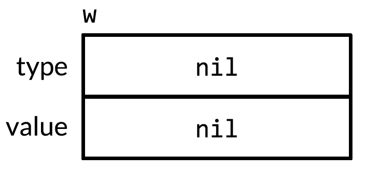
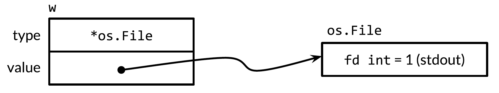
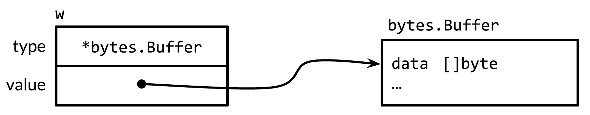
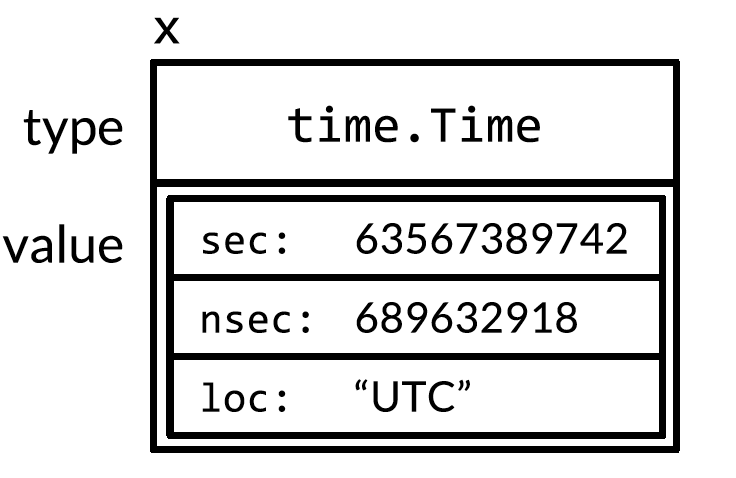

# Sum
- A concrete type specifies the exact representation of its values and exposes the intrinsic operations of that representation. However, when you have a value of an interface, you know nothing about what it is; you know only what it can do, or more precisely, what behaviors are provided by its methods.
- 传递一个实现了接口定义的方法（“是”某接口）的实体类型作为参数给某个方法，接收该接口类型作为参数的方法（保证）会在自身逻辑内需要调用该接口方法的地方调用到该实体类型对该接口方法的具体实现。目的是实现该接口的实体类型得到统一的处理。如统一需要调用方法 `Foo` 的地方，传入的实体类型参数确实有该方法可被调用，但并不关心方法的具体实现
- Discriminated union: 对于满足同一个接口的集合，用 type switch 确定集合成员的具体实体类型，从而对不同的实体类型用差异化的逻辑去处理
- `io.Writer` interface provides an abstraction of all the types **to which bytes can be written**; A `Reader` interface represents any type **from which you can read bytes**; A `Closer` interface is any value you can close.
- An expression may be assigned to an interface if its type satisfies the interface. This rule applies even when the right-hand side is itself an interface.
    - Explicit or implicit from a concrete type to an interface type captures the **type and the value** of its operand.
    
        ```go
        var w io.Writer
        // implicit conversion
        w = os.Stdout
        // explicit conversion
        w = io.Writer(os.Stdout)
        ```

- An interface wraps and **conceals** the concrete type and value that it holds. Only the methods revealed by **the interface type** may be called, even if the concrete type has others
- Interface value: a value of an interface type
    - A **concrete type** and a value of that type
    - `(value, type)` tuple: dynamic value, dynamic type
# Plain Words
- 多态
    - 函数参数类型是接口类型
    - 调用函数时，传实现该接口的 concrete type 作为参数
    - 效果是调用到该接口在对应类型下的特定实现
# A Tour of Go
- An interface type is defined as a set of method signatures
- **A value of interface type** can ***hold* any value** that implements those methods
- **A type implements an interface by implementing its methods**. There's no explicit declaration of intent, no `implement` keyword

    ```go
    type I interface {
        M()
    }
    type T struct {
        S string
    }
    // This method means type T implements the interface I,
    // but we don't need to explicitly declare that it does so
    func (t T) M() {
        fmt.Println(t.S)
    }
    ```

    - *Implicit interfaces* decouple the definition of an interface from its implementation, which could then appear in any package without prearrangement
- Under the hood, interface values can be thought of as a **tuple of a value and a concrete type** - `(value, type)`
- A interface value holds a value of a specific underlying **concrete type**
- Calling a method on an interface value executes the method of the same name on its underlying concrete type

    ```go
    type I interface {
        M()
    }
    type T struct {
        S string
    }
    func (t *T) M() {
        fmt.Println(t.S)
    }
    type F float64
    func (f F) M() {
        fmt.Println(f)
    }
    func main() {
        var i I
        i = &T{"Hello"}
        describe(i) // &{Hello} ,*main.T
        i.M()

        i = F(math.Pi)
        describe(i) // 3.141592653589793, main.F
        i.M() // 3.141592653589793
    }
    func describe(i I) {
        fmt.Printf("%v, %T", i, i)
    }
    ```

- If the concrete value inside the interface itself is nil, the method will be called with a nil receiver. An interface value that holds a nil concrete value is itself non-nil
- A *nil interface* value holds neither value nor concrete type. Calling a method on a nil interface is a run-time error because there's no type inside the interface tuple to indicate which concrete method to call

    ```go
    type I interface {
        M()
    }
    func main() {
        var i I
        describe(i)
        i.M()
    }
    func describe(i I) {
        fmt.Printf("(%v, %T)\n", i, i)
    }
    ```

- The interface type that specifies 0 methods is known as the *empty interface* (`interface{}`)
    - An empty interface may hold values of any type (every type implements at least 0 method)
    - Empty interfaces are used by code that handles values of unknown type
## Type assertion
- 断言一个接口 `i` hold 的 concrete type 是类型 `T`
    1. 断言成功即拿到该 concrete value 的值
       - 断言的成功即拿到被 interface value 的 `(value, type)` 信息
    2. 断言失败
        - 用到两个返回值的 test 格式：拿到类型 `T` 的 zero value，panic
        - 直接断言的格式：panic
- A type assertion provides access to an interface value's **underlying concrete value**

    ```go
    t := i.(T) // T is type
    ```

    - This statement asserts that the interface value `i` holds the concrete ***type*** `T` and assigns the underlying `T` value to the variable `t`
    - If `i` does not hold a `T`, it will trigger a panic
- To test whether an interface holds a specific type, a type assertion can return 2 values: the underlying value and a boolean value that reports whether the assertion succeeded

    ```go
    t, ok := i.(T)
    ```

    - If `i` holds a `T`, then `t` will be the underlying value (**of type `T`**) and `ok` will be true
    - If not, `ok` wil be false and `t` will be the **zero value** of type `T`, and no panic occurs

    ```go
    var i interface{} = "hello"
    s := i.(string)
    fmt.Println(s)
    s, ok := i.(string)
    fmt.Println(s, ok)

    f, ok := i.(float64)
    fmt.Println(f, ok)
    f = i.(float64) // panic
    fmt.Println(f)
    ```

## Type switches
- *类型匹配*用于测试接口类型 `i` hold 的值是什么类型
    1. 匹配成功后，就是一个类型断言
    2. 匹配失败，见 default
- A type switch is a construct that permits **several type assertions in series**
- A type switch is like a regular switch statement, but the cases specify types (not values), and those values are compared against the type of the value held by the given **interface** (value). The declaration in a type switch has the same syntax as a type assertion, but the specific type `T` is **replaced** with the **keyword** `type`

    ```go
    switch v := i.(type) {
    case T:
        // here v has type T
    case S:
        // here v has type S
    default:
        // no match; here v has the same type as i
    }

    func do(i interface{}) {
        switch v := i.(type) {
        case int:
            fmt.Printf("Twice %v is %v\n", v, v*2)
        case string:
            fmt.Printf("%q is %v bytes long\n", v, len(v))
        default:
            fmt.Printf("I don't know about type %T!\n", v)
        }
    }
    do(21)
    do("hello")
    do(true)    
    ```

    - The `switch` statement tests whether the interface value `i` holds a value of type `T` of `S`
    - In each case of `T` and `S` case, the variable `v` will be of type `T` or `S` respectively and hold the concrete value held by `i`
    - In the **default case** (where there' no match), `v` is of the same interface type and value as `i`
## Stringers
- One of the most ubiquitous interfaces is `Stringer` defined by the `fmt` package

    ```go
    type Stringer interface {
        String() string
    }
    ```

- A `Stringer` is a type that can describe itself as a string. The `fmt` and many other packages **look for this interface to print values**

    ```go
    type Person struct {
        Name string
        Age int
    }
    func (p Person) String() string {
        // return formatted string
        return fmt.Sprintf("%v (%v years)", p.Name, p.Age)
    }
    a := Person{"SB", 30}
    fmt.Println(a)
    ```

## Errors
- Go programs express error state with `error` values. The `error` type is a built-in interface similar to `fmt.Stringer`

    ```go
    type error interface {
        Error() string
    }
    ```

- The `fmt` package looks for the `error` interface when printing `error` values

    ```go
    type MyError struct {
        When time.Time
        What string
    }
    func (e *MyError) Error() string {
        return fmt.Sprintf("at %v, %s", e.When, e.What)
    }
    func run() error {
        return &MyError{
            time.Now(),
            "it didn't work",
        }
    }
    if err := run(); err != nil {
        fmt.Println(err)
    }
    ```

- A call to `fmt.Sprint(e)` inside the `Error` method wil send the program into an infinite loop
    - `fmt.Sprint(e)` will call `e.Error()` (if exists) to convert the value `e` to a string. If the `Error()` method calls `fmt.Sprint(e)` (inside `Error` method), then the program recurses until out of memory. Break the recursion by converting the `e` to a value without a `String` or `Error` method (`fmt.Sprint(float64(e))`)
    - > https://stackoverflow.com/questions/27928744/an-infinite-loop-produced-by-fmt-sprinte-inside-the-error-method
    - > https://stackoverflow.com/questions/27928744/an-infinite-loop-produced-by-fmt-sprinte-inside-the-error-method
## Readers
- The `io` package specifies the `io.Reader` interface that represents the read end of a stream of data
- The `io.Reader` has a `Read` method

    ```go
    func (T) Read(b []byte) (n int, err error)
    ```

- `Read` populates the given byte slice with data and returns the number of bytes populated and an error value. It returns an `io.EOF` error when the stream ends

    ```go
    // creates a `strings.Reader` and consumes its output 8 bytes at a time
    func main() {
        r := strings.NewReader("hello, reader!")
        b := make([]byte, 8)
        for {
            n, err := r.Read(b)
            fmt.Printf("n = %v err = %v b = %v\n", n, err, b)
            fmt.Printf("b[:n] = %q\n", b[:n])
            if err == io.EOF {
                break
            }
        }
    }
    ```

# Summaries
- Satisfy - implement all methods of
- A call through an interface must use dynamic dispatch instead of a direct call. The **compiler** generates code to obtain the address of the specified method (e.g., `Write`) from the type descriptor, than make an indirect call to that address
- In order to **handle** `Audio` and `Video` items **in the same way**, we can define a `Streamer` interface to represent their common aspects without changing any existing type declarations
- An **interface type** specifies a set of methods that a concrete type must possess to be considered an **instance of that interface**
- **A type *satisfies* an interface** if it **possesses all the methods the interface requires**
    - `*os.File` satisfies `io.Reader`, `Writer`, `Closer`, `ReadWriter`
    - `*bytes.Buffer` satisfies `Reader`, `Writer`, `ReadWriter`
    - As a shorthand, Go programmers often say that a concrete type ***"is a"*** particular interface, meaning that it satisfies the interface
        - A `*bytes.Buffer` is an `io.Writer`; an `*os.File` is an `io.ReadWriter`
- Interface satisfaction depends only on the **methods** of the 2 types involved
- **An expression may be assigned to an interface value if its type satisfies the interface**
    - This rule applies even when the right-hand side is itself an interface value
    - The left side of `=` is still the same interface
- The ***empty interface type*** `interface{}`
    - It places no demands on the types that satisfy it
    - We can assign any value to the empty interface
- An interface wraps and **conceals** the concrete type and value that it holds. Only the methods revealed by the interface type may be called, even if the concrete type has others
- An ***interface value*** (a value of an interface type)

    ```go
    var w io.Writer // nil interface value
    w = os.Stdout // non-nil interface value
    ```

- An interface value has 2 components (obtained from declaration or assignment)
   1. A concrete type, called the interface value's *dynamic type*
        - In general, we cannot know at compile time what the dynamic type an interface value will be
        - Use `fmt`'s `%T` verb to report the dynamic type of an interface value
   2. A value of that concrete type, called *dynamic value*
- `var w io.Writer; w = os.Stdout`
    - This involves an **implicit conversion** from a concrete type to an interface type, and is equivalent to the explicit conversion `io.Writer(os.Stdout)`
- The zero value for an interface (of certain type) value has both its dynamic type and dynamic value set to `nil`
- An interface value is described as nil or non-nil based on its **dynamic type**
    - Use `w == nil` or `w != nil` to test whether an interface value is nil
- A type assertion (`x.(T)`) is an operation applied to an ***interface value***
    - A type assertion to a **concrete** type extracts the concrete (dynamic) value from the interface value
        - The type assertion checks whether **`x`'s dynamic type** (not `x`'s interface type) is identical to `T`
    - The **result** of a (successful) type assertion to an **interface**(`T`) is still an interface value with the same type and value components, but the **result** has the interface type `T`, making a different (usually larger) set of methods accessible
        - The type assertion checks whether **`x`'s dynamic type** (not `x`'s interface type) **satisfies `T`**


- Interfaces are **abstract types** that allow us to treat different **concrete types** in the same way based on what **methods** they have, not how they are represented or implemented
- Go's interfaces are **satisfied implicitly**. There's no need to declare all the interfaces that a given concrete type satisfies; simply **possessing the necessary methods is enough**
- This design lets you **create new interfaces** that are **satisfied by existing concrete types [x] without changing the existing types**, which is particularly useful for types defined in packages that you don't control
# Interface as contracts
- A concrete type specifies the exact representation of its values and exposes the intrinsic operations of that representation, such as arithmetic for numbers, or indexing, `append` and `range` for slices. A concrete type may also provide additional behaviors through its methods. When you have a value of a concrete type, you know exactly what it is and what you can do with it
- An interface is an abstract type
    - It doesn't expose the representation or internal structure of its values, or the set of basic operations they support
    - It reveals only **some of their methods**
- When you have a value of an interface, you know nothing about what it is; you know only what it can do, or more precisely, what behaviors are provided by its methods
- `fmt.Fprintf`

    ```go
    package fmt

    // Fprintf formats according to a format specifier and writes to w
    func Fprintf(w io.Writer, format string, args ...interface{}) (int, error)

    func Printf(format string, args ...interface{}) (int, error) {
        return Fprintf(os.Stdout, format, args...)
    }

    func Sprintf(format string, args ...interface{}) string {
        var buf bytes.Buffer
        Fprintf(&buf, format, args...)
        return buf.String()
    }
    ```

    - The `F` prefix of `Fprintf` stands for *file* and indicates that the formatted output should be written to the file provided as the first argument
    - In the `Printf` case, `os.Stdout` is an `*os.File` (a file)
    - In the `Sprintf` case, the argument is not a file, though it superficially resembles one: `&buf` is a pointer to a memory buffer to which bytes can be written
    - The first parameter of `Fprintf` is not a file. It's an `io.Writer` (interface type)

        ```go
        package io
        // `Writer` is the interface that wraps the basic Write method
        type Writer interface {
            // Write writes `len(p)` bytes from p to the underlying data stream
            // It returns the number of bytes written from p and any error
            // encountered that caused the write to stop early
            // Must return a non-nil error if it returns n < len(p)
            // Must not modify the slice data, even temporarily
            Write(p []byte) (n int, err error)
        }
        ```

- The `io.Writer` interface defines the contract between `Fprintf` and its callers
   1. The contract **requires** that the caller provides a value of a concrete type like `*os.File` or `*bytes.Buffer` that has a method called `Write` with the appropriate signature and behavior
   2. The contract **guarantees** that `Fprintf` will do its job (**invokes `w`'s certain methods**, in this case, `Write`) given any value that satisfies the `io.Writer` interface
       - `Fprintf` may not assume that it is writing to a file or to memory, only that it can call `Write`
- Because `fmt.Fprintf` assumes nothing about the representation of the value (of its first argument) and relies only on the behaviors guaranteed by the `io.Writer` contract, we can safely pass a value of any concrete type that satisfies `io.Writer` as the first argument to `fmt.Fprintf`. The freedom to substitute one type for another that satisfies the same interface is called *substitutability*
- `fmt.Stringer`

    ```go
    package fmt
    // The String method is used to print values passed as an operand to any format that accepts a string
    // or to an unformatted printer such as Print
    type Stringer interface {
        String() string
    }
    ```

# Interface type
- An **interface type** specifies a set of methods that a concrete type must possess to be considered an **instance** of that interface
    - `io.Writer` interface provides an abstraction of all the types **to which bytes can be written**, which includes files, memory buffers, network connections, HTTP clients, archivers, hashers, and so on. A `Reader` interface represents any type **from which you can read bytes**. A `Closer` interface is any value you can close, such as a file or a network connection

    ```go
    package io
    type Reader interface {
        Reader(p []byte) (n int, err error)
    }
    type Closer interface {
        Close() error
    }
    ```

- Declarations of new interface types as combinations of existing ones

    ```go
    type ReaderWriter interface {
        Reader
        Writer
    }
    ```

    - This syntax lets us name another interface as a shorthand for writing out all of its methods. It's called *embedding an interface*
    - 2 declaration style can be mixed

    ```go
    type ReaderWriter interface {
        Reader(p []byte) (n int, err error)
        Writer
    }
    ```

    - The order in which the methods appear doesn't matter. All that matters is the set of methods
# Interface satisfaction
- A type *satisfies* an interface if it **possesses all the methods** the interface requires
    - `*os.File` satisfies `io.Reader`, `Writer`, `Closer`, `ReadWriter`
    - `*bytes.Buffer` satisfies `Reader`, `Writer`, `ReadWriter`
    - As a shorthand, Go programmers often say that a concrete type ***"is a"*** particular interface, meaning that it satisfies the interface
        - A `*bytes.Buffer` is an T`io.Writer`; an `*os.File` is an `io.ReadWriter`
- An expression may be assigned to an interface if its type satisfies the interface. This rule applies even when the right-hand side is itself an **interface**
- > It's legal to call a `*T` method on an argument of type `T` so long as the argument is a variable; the compiler implicitly takes its address. This is mere **syntactic sugar**
- A value of type `T` does not possess all the methods that a `*T` pointer does, and as a result it might satisfy fewer interfaces

    ```go
    type IntSet struct { /* ... */ }
    func (*IntSet) String() string
    // cannot call that method on a non-addressable IntSet value
    var _ = IntSet{}.String() // compile error

    // s is a variable and &s has a String method
    var s IntSet
    var _ = s.String()      // syntactic sugar
    var _ fmt.Stringer = &s
    var _ fmt.Stringer = s // compile error: IntSet lacks String method
    ```

- An interface wraps and **conceals** the concrete type and value that it holds. Only the methods revealed by **the interface type** may be called, even if the concrete type has others

    ```go
    os.Stdout.Write([]byte("hello")) // OK: *os.File has Write method
    os.Stdout.Close // OK: *os.File has Close method

    var w io.Writer
    w = os.Stdout
    w.Write([]byte("hello")) // OK: *os.File has Write method
    w.Close // compile error: io.Writer lacks Close method
    ```

- The type `interface{}` (***empty interface type***) places no demands on the types that satisfy (implement) it, we can assign any value to the empty interface
- Since interface satisfaction depends only on the methods of the 2 types involved, there's no need to declare the relationship between a concrete type and the interfaces it satisfies. That said, it's occasionally useful to **document** and assert the relationship when it's intended but not otherwise enforced by the program

    ```go
    // asserts at compile time that a value of type *bytes.Buffer satisfies `io.Writer`
    var w io.Writer = new(bytes.Buffer)
    ```

    - We needn't allocate a new variable since any value of type `*bytes.Buffer` will do, even `nil`, which we write as `(*bytes.Buffer)(nil)` using an explicit conversion
    - Since we never intend to refer to `w`, we can replace it with the blank identifier

        ```go
        var _ io.Writer = (*bytes.Buffer)(nil)
        ```

- Non-empty interface types such as `io.Writer` are most often satisfied by a **pointer** type, particularly when one or more of the interface methods implies some kind of **mutation to the receiver**, as the `Writer` method does
    - A pointer to a struct is an especially common method-bearing type
- Pointer types are by no means the only types that satisfy interfaces
- Even interfaces with mutator methods may be satisfied by one of Go's other reference types
- Basic types may satisfy interfaces
- A concrete type may satisfy many unrelated interfaces
- Interfaces are one useful way to group related concrete types together and express the facets they share in common

    ```go
    type Audio interface {
        Stream() (io.ReadCloser, error)
        RunningTime() time.Duration
        Format() string // e.g., MP3, WAV
    }
    type Video interface {
        Stream() (io.ReadCloser, error)
        RunningTime() time.Duration
        Format() string // e.g., MP3, WMV
        Resolution() (x, y int)
    }
    type Streamer interface {
        Stream() (io.ReadCloser, error)
        RunningTime() time.Duration
        Format() string // e.g., MP3, WAV
    }
    ```

    - In order to handle `Audio` and `Video` items in the same way, we can define a `Streamer` interface to represent their common aspects without changing any existing type declarations
- Each grouping of concrete types based on their shared behaviors can be expressed as an interface type
- Unlike class-based languages, in which the set of interfaces satisfied by a class is explicit, in Go,we can define new abstractions or groupings of interest when we need them, without modifying the declaration of concrete type
# Parsing flags with `flag.Value`
- `flag.Duration` (ch7/sleep)
- `flag.Value` is the interface to the value stored in a flag

    ```go
    package flag
    type Value interface {
        String() string
        Set(string) error
    }
    ```

    - `String` formats the flag's value for use in command-line help messages; every `flag.Value` is also a `fmt.Stringer`
    - `Set` parses its string argument and updates the flag value. In effect, the `Set` method is the inverse of the `String` method, and it's good practice for them to use the same notation
- In order to define new flag notations for our own data types, we need only define a type that satisfies the `flag.Value` interface (ch7/tempflag)
# Interface value
- Conceptually, a value of an interface type, or *interface value*, has 2 components, a concrete type and a value of that type, called the interface's *dynamic type* and *dynamic value*
    - For statically typed languages, types are a compile-time concept, so a type is not a value
- In our conceptual model, a set of values called **type descriptors** provide information about each type, such as its name and methods. In an interface value, the type component is represented by the appropriate descriptor

    ```go
    var w io.Writer         // 1
    // os.Stdout is of *os.File type
    w = os.Stdout           // 2
    w = new(bytes.Buffer)   // 3
    w = nil                 // 4
    ```

- In Go, variables are always initialized to a well-defined value. The zero value for an interface has both its type and value components set to `nil`

    

- An interface value is described as nil or non-nil based on its **dynamic type**. So `w` in `1` is a nil interface value
    - Use `w == nil` or `w != nil` to test whether an interface value is nil
    - Calling any method on a nil interface value causes a panic
- `2` involves an **implicit conversion** from a concrete type to an interface type, and is equivalent to the explicit conversion `io.Writer(os.Stdout)`
    - A conversion of this kind, whether explicit or implicit, captures the type and the value of its operand
    - The interface (of `io.Writer` type) value's dynamic type is set to the type descriptor for the pointer type `*os.File`, and its dynamic value holds a **copy** of `os.Stdout`, which is a **pointer** to the `os.File` variable representing the standard output of the process

        

    - Calling the `Write` method on an interface value containing an `*os.File` pointer causes the `(*os.File).Write` method to be called

        ```go
        w.Write([]byte("hello")) // "hello"
        ```

    - In general, we cannot know at compile time what the dynamic type an interface value will be, so a call through an interface must use dynamic dispatch. Instead of a direct call, the **compiler** must generate code to obtain the address of the method named `Write` from the type descriptor, then make an indirect call to that address
    - The **receiver argument** for the call is a **copy** of the interface's dynamic value, `os.Stdout`. The effect is as if we make this call directly

        ```go
        os.Stdout.Write([]byte("hello"))
        ```

- In `3`, the dynamic type is now `*bytes.Buffer` (print using `%T`) and the dynamic value is a pointer to the newly allocated buffer. The type descriptor is `*bytes.Buffer`, so the `(*bytes.Buffer).Write` is called, with the address of the buffer as the value of the receiver parameter. The call appends "hello" to the buffer

    

    - > https://golang.org/pkg/bytes/#NewBuffer

    ```go
    w.Write([]byte("hello"))
    ```

- `4` sets **both** `w`'s components back to `nil`, restoring `w` to the same state as when its was declared
- An interface value can hold arbitrarily large dynamic values
    - `time.Time` type represents an instant in time, is a struct type with several unexported fields

        ```go
        var x interface{} = time.Now()
        ```

    - Conceptually, the **dynamic value** always fits inside the interface value, no matter how large its type (the image is a conceptual model; a realistic implementation is quite different)
    
        

- Interface values may be compared using `==` and `!=` (comparable)
    - 2 interface values are equal if both are nil, or if their **dynamic types are identical** and their dynamic values are equal according to the usual behavior of **`==`** for that type
- If 2 interface values are compared and have the same dynamic type, but that type is not comparable (a slice, for example), then comparison fails with a panic

    ```go
    var x interface{} = []int{1, 2, 3}
    fmt.Println(x == x) // panic: comparing uncomparable type []int
    ```

    - When comparing interface values or aggregate types that contain interface values, be aware of the potential for a panic
    - A similar risk exists when using interfaces as map keys or switch operands
    - Only compare interface values if you're certain that they contain dynamic values of comparable types
- When handling errors, or during debugging, it's often helpful to report the dynamic type of an interface value (use `fmt`'s `%T` verb)
    - > Internally, `fmt` uses refection to obtain the name of the interface's dynamic type
## Caveat: an interface containing a nil pointer is non-nil
- An interface value is described as nil or non-nil based on its **dynamic type**. Use `w == nil` or `w != nil` to test whether an interface value is nil
    - The zero value for an interface has both its type and value components set to `nil`
- A nil interface value, which contains no value at all, is not the same as an interface value containing a pointer that happens to be nil (has type but no value)

    ```go
    const debug = true
    func main() {
        // buf here is a concrete type (struct)
        var buf *bytes.Buffer
        if debug {
            buf = new(bytes.Buffer)
        }
        f(buf) // subtly incorrect!
        if debug {
            // ...use buf...
        }
    }
    // If out is non-nil, output will be written to it
    func f(out io.Writer) {
        // ...do sth...
        if out != nil {
            out.Write([]byte("done\n"))
        }
    }
    // *bytes.Buffer（结构体）的零值（值是 nil，类型是 *bytes.Buffer）传入 f, out 是动态类型为 *byte.Buffer 的 interface value，此时 out != nil
        // The zero value for a pointer of any type is nil
    // 动态类型和动态值都为 nil 的 interface value 和 nil 作相等比较是 true
    // io.Writer 是接口类型，它的零值的 type 和 value 都为 nil，和 nil 作相等比较是 true
    ```

    - Changing `debug` to `false` causes the program to panic during the `out.Write` call. When `main` calls `f`, it assigns a nil pointer of type `*bytes.Buffer` to the `out` parameter, so the dynamic value of `out` is `nil`. However, its dynamic type is `*bytes.Buffer`, meaning that `out` is a non-nil interface containing a nil pointer value, so the defensive check `out != nil` is still true
    - The dynamic dispatch mechanism determines that `(*bytes.Buffer).Write` must be called but this time with a receiver value that is nil. For some types, such as `*os.File`, `nil` is a valid receiver, but `*bytes.Buffer` is not among them. The method is called, but it panics as it tries to access the buffer
- The problem is that although a nil `*bytes.Buffer` pointer has the methods needed to satisfy the interface, it doesn't satisfy the **behavioral requirements** of the interface. In particular, the call violates the implicit **precondition** of `(*bytes.Buffer).Write` that its receiver is not nil, so assigning a nil pointer to the interface was a mistake
- The solution is to change the type of `buf` in `main` to `io.Writer`, thereby avoiding the assignment of the dysfunctional value to the interface in the first place

    ```go
    // io.Writer is an interface type, now `buf` is the io.Writer-typed interface's zero value
    var buf io.Writer
    ```

    - `io.Writer` 是接口类型，虚拟类型，它的零值的 type 和 value 都为 nil; `*bytes.Buffer` 是指针类型，实体类型，它的零值是 `*bytes.Buffer(nil)`，但是有类型
# Sorting with `sort.Interface`
- `sort` package provides in-place sorting of any sequence according to any ordering function
- In many languages, the sorting algorithm is associated with the sequence data type, while the ordering function is associated with the type of the elements
- Go's `sort.Sort` assumes nothing about the representation of either the sequence or its elements. It uses an **interface**, `sort.Interface`, to specify the contract between the generic sort algorithm and each sequence type that may be sorted. An implementation of this interface determines both the concrete representations of the sequence, which is often a slice, and the desired ordering of its elements
- A in-place sort algorithm needs 3 things - the length of the sequence, a means of comparing 2 elements, and a way to swap 2 elements. They are 3 methods of `sort.Interface`

    ```go
    package sort
    type Interface interface {
        Len() int
        Less(i, j int) bool // i, j are indices of sequence elements
        Swap(i, j int)
    }
    ```

- To sort any sequence, we need to define a type that implements these 3 methods, then apply `sort.Sort` to an instance of that type

    ```go
    type StringSlice []string
    // The underlying type of a named type determines its structure and representation, and also the set of intrinsic operations it supports, which are the same as if the underlying type had been used directly
    func (p StringSlice) Len() int { return len(p) }
    func (p StringSlice) Less(i, j int) bool { return p[i] < p[j] }
    func (p StringSlice) Swap(i, j int) { p[i], p[j] = p[j], p[i] }

    s := []string{"Go", "C", "JavaScript", "Python"}
	// name := StringSlice{"Go", "C", "JavaScript", "Python"}
	name := StringSlice(s)
	sort.Sort(name)
    ```

    - Sorting a slice of strings is so common that the `sort` package provides the `StringSlice` type, as well as a function called `Strings` so that the call above can be simplified to `sort.Strings(names)`
- > [ ] Although the code would work if we stored the `Tracks` directly, the sort function will swap many paris of elements, so it will run faster if each element is a pointer, which is a single machine word, instead of an entire `Track`, which might be 8 words or more
- The `sort` package defines an unexported type `reverse`, which is a struct that embeds a `sort.Interface`

    ```go
    // composition: embedded struct
    package sort
    type reverse struct{ Interface } // that is, sort.Interface
    func (r reverse) Less(i, j int) bool { return r.Interface.Less(j, i) }

    // implicitly assigns the argument values to the corresponding parameter variables
    func Reverse(data Interface) Interface { return reverse{data} }
    ```

    - The `Less` method for `reverse` calls the `Less` method of the ***embedded*** `sort.Interface` value, but with the indices flipped, reversing the order of the sort results
    - `Len` and `Swap`, the other 2 methods of `reverse`, are implicitly provided by the original `sort.Interface` because it's an embedded field
    - The exported function `Reverse` returns an instance of the `reverse` type that contains the original `sort.Interface` value
- `IsSorted` checks whether a sequence is already sorted. It abstracts both the sequence and its ordering function using `sort.Interface`, but it **never calls the `Swap` method**
- For convenience, the `sort` package provides versions of its functions and types specialized for `[]int`, `[]string`, and `[]float64` using their natural orderings
# The `http.Handler` interface
- `http.Handler`

    ```go
    package http
    type Handler interface {
        ServeHTTP(w ResponseWriter, r *Request)
    }
    func ListenAndServe(address string, h Handler) error
    ```

    - `ListenAndServe` requires a server address, and an instance of `Handler` interface to which all requests should be dispatched. It runs forever, or until the server fails (or fails to start) with an error, always non-nil, which it returns
- `http.ResponseWriter` augments `io.Writer` with methods for sending HTTP response headers
- `net/http` provides `ServeMux`, a request *multiplexer*, to simplify the association between URLs and handlers
    - > Obviously we could keep adding cases to `ServeHTTP`, but in a realistic application, it's convenient to define the logic for each case in a separate function or method. Furthermore, related URLs may need similar logic; several image files may have URLs of the form `/images/*.png`
- Different types satisfying the same interface are *substitutable*: the web server can dispatch requests to any `http.Handler`, regardless of which concrete type is behind it
- A `ServeMux` aggregates a collection of `http.Handlers` into a single `http.Handler`

    ```go
    mux := http.NewServeMux()
    mux.Handle("/list", http.HandlerFunc(db.list))
	log.Fatal(http.ListenAndServe("localhost:8000", mux))    
    ```

    - `db.list` is a method value, that is, a value of type `func(w http.ResponseWriter, req *http.Request)`, that when called, invokes the `database.list` method with the receiver value `db`. `db.list` is a **function** that implements handler-like behavior, but since it has no methods, it doesn't satisfy the `http.Handler` interface and cannot be passed directly to `mux.Handle`. `http.HandlerFunc` is a **conversion**, not a function call

        ```go
        package http
        type HandlerFunc func(w ResponseWriter, r *Request)
        func (f HandlerFunc) ServeHTTP(w ResponseWriter, r *Request) {
            f(w, r)
        }
        ```

        - `HandleFunc` a **function type that has methods and satisfies an interface**, `http.Handler`. The behavior of its `ServeHTTP` is to call the underlying function
        - `HandlerFunc` is thus an **adapter** that lets a function value satisfy an interface, where the function (`HandlerFunc`) and the interface's sole method have the same signature
        - This trick lets a single type such as `database` satisfy the `http.Handler` interface several different ways: once through its `list` method, once through its `price` method
    - Because registering a handler this way is so common, `ServeMux` has a convenience method `HandleFunc` to do the handler registration (`mux.HandleFunc("/list", db.list)`)
- It's easy to see how one would construct a program in which there are 2 different web servers, listening on different ports, defining different URLs, and dispatching to different handlers. We would just construct another `ServeMux` and make another call to `ListenAndServe`, perhaps concurrently
- Also, it's typical to define HTTP handlers across many files of an application, and it would be nuisance if they all had to be explicitly registered with the application's `ServeMux` instance
- For convenience, `net/http` provides a global `ServeMux` instance called `DefaultServeMux` and package-level functions called `http.Handle` and `http.HandleFunc`. To use `DefaultServeMux` as the server's main handler, we needn't pass it to the `ListenAndServe`; `nil` will do
- **Reminder**: the web server invokes each handler in a new goroutine, so handlers must take precautions such as **locking** when accessing variables that other goroutines, including other requests to the same handler, may be accessing
# The `error` interface
- `error` interface

    ```go
    type error interface {
        Error() string
    }
    ```

- `errors` package

    ```go
    package errors
    type errorString struct { text string }
    func New(text string) error { return &errorString{text} }
    func (e *errorString) Error() string { return e.text }
    ```

- The simplest way to create an `error` is by calling `errors.New`, which returns a new `error` for a given error message
- The underlying type of `errorString` is a struct, not a string, to protect its representation from inadvertent (or premeditated) updates
- The reason that the pointer type `*errorString`, not `errorString` alone, satisfies the `error` interface is so that every call to `New` allocates a **distinct `error` instance** that is equal to no other

    ```go
    fmt.Println(errors.New("EOF") == errors.New("EOF")) // "false"
    ```

    - We would not want a distinguished error such as `io.EOF` to compare equal to one that merely happened to have the same message
- Calls to `errors.New` are relatively infrequent because there's a convenient wrapper function, `fmt.Errorf`

    ```go
    package fmt
    import "errors"
    func Errorf(format string, args ...interface{}) error {
        return errors.New(Sprintf(format, args...))
    }
    ```

- `*errorString` is not the only type of `error`. The `syscall` package provides Go's low-level system call API. On many platforms, it defines a numeric type `Errno` that satisfies `error`, and on Unix platfomrn , `Errno`'s `Error` methods does a lookup n a table of strings

    ```go
    // Unix platforms
    package syscall
    type Errno uintptr // operating system error code
    var errors = [...]string {
        1: "operation not permitted", // EPERM
        2: "no such file or directory", // ENOENT
        3: "no such process", // ESRCH
        // ...
    }
    func (e Errno) Error() string {
        if 0 <= int(e) && int(e) < len(errors) {
            return errors[e]
        }
        return fmt.Sprintf("errno %d", e)
    }

    var err error = syscall.Errno(2)
    fmt.Println(err.Error()) // no such file or directory
    fmt.Println(err) // no such file or directory
    ```

- `Error` is an efficient representation of system call errors drawn from a finite set, and it satisfies the standard `error` interface
# Example: expression evaluator
- By separating the static checks from the dynamic ones, we can detect errors sooner and perform many checks only once instead of each time an expression is evaluated


<!-- to be reviewed -->
# Type assertions
- A type assertion is an operation applied to an **interface value**
- `x.(T)`
    - `x` is an expression (an interface value) of an interface type and `T` is a type, called the "asserted" type
    - `x` is the operand
    - `T` is the asserted type
- A type assertion checks that the interface's dynamic type of its operand matches the asserted type
   1. The asserted type is a concrete type
        - The type assertion checks whether `x`'s dynamic type is identical to `T`. If this check succeeds, the result of the type assertion is `x`'s **dynamic value**. If the check fails, then the operation panics
        - **A type assertion to a concrete type extracts the concrete value from its operand (the interface value)**
   2. The asserted type is an interface type
        - The type assertion checks whether `x`'s dynamic type **satisfies `T`**. If this check succeeds, the dynamic value is not extracted; the **result** is still an interface value with the same type and value components, but the **result** has the interface type `T`
        - A type assertion to an interface type changes the **type of the expression**, making a different (usually **larger**) set of methods accessible, but it preserves the dynamic type and value components inside the interface value (若 `x` 接口类型的要求的方法数量上少于它的动态类型拥有的方法，`x` 就会隐藏它的动态类型的部分方法，通过对接口 `T` 做断言，`x` 的动态类型的全部方法又都可用了)
            - A type assertion to a less restrictive interface type (one with fewer methods) is rarely needed, as it behaves just like an assignment, except in nil case

            ```go
            /* 
            type ByteCounter int
            func (c *ByteCounter) Write(p []byte) (int, error) {
                *c += ByteCounter(len(p)) // convert int to ByteCounter
                return len(p), nil
            }

            type ReadWriter interface {
                Reader
                Writer
            } 
            */

            var w io.Writer
            w = os.Stdout
            rw := w.(io.ReadWriter) // success: *os.File (w) has both Read and Write

            w = new(ByteCounter)
            rw = w.(io.ReadWriter) // panic: *ByteCounter has no Read method
            ```

            - After the first type assertion, both `w` and `rw` hold `os.Stdout` so each has a dynamic type of `*os.File`, but `w`, an `io.Writer`, exposes only the file's `Write` method, whereas `rw` exposes its `Read` method too
            - `new` returns a pointer
    - No matter what type was asserted, if the operand is nil interface value, the type assertion fails
- Often we're not sure of the dynamic type of an interface value, and we'd like to test whether it is some particular type
- If the type assertion appears in an assignment in which 2 results are expected, the operation does not panic on failure but instead returns an additional second result, a boolean indicating success

    ```go
    // File, Buffer are structs, concrete type
    // os.Stdout is of type `*os.File`
    var w io.Writer = os.Stdout // w captures io.Stdout's type and value
    f, ok := w.(*os.File) // success: ok, f == os.Stdout
    fmt.Println(f == os.Stdout) // true

    // type `*os.File` is not same as type `*bytes.Buffer`
    b, ok := w.(*bytes.Buffer) // failure: !ok, b == nil
    ```

    - If operation failed, `ok` is false, and the first result is equal to the **zero value of the asserted type**, which is a nil `*bytes.Buffer` (not an interface type)

    ```go
    // compact form
    if f, ok := w.(*os.File); ok {
        // ...use f...
    }
    ```

- When the operand (the interface value `x`) is a variable, rather than invent another name for the new local variable, you'll sometimes see the original name reused, shadowing the original

    ```go
    if w, ok := w.(*os.File); ok {
        // ...use w...
    }
    ```

# Discriminating errors with type assertions
- I/O can fail for any number of reasons, but 3 kinds of failure often must be handled differently: file already exists (for create operations), file not found (for read operations), and permission denied
- The `os` package provides 3 helper function to classify the failure indicated by a given `error` value

    ```go
    package os
    func IsExist(err error) bool
    func IsNotExist(err error) bool
    func IsPermission(err error) bool
    ```

- A naive implementation of one of these predicates might check that the error message contains a certain substring

    ```go
    func IsNotExist(err error) bool {
        return strings.Contains(err.Error(), "file does not exist")
    }
    ```

    - The logic for handling I/O errors can vary from one platform to another, this approach is not robust and the same failure may be reported with a variety of different error messages. Checking for substrings of error messages may be useful during testing to ensure that functions fail in the expected manner, but it's inadequate for production code
- A more reliable approach is to represent structured error values using a dedicated type
- The `os` package defines a type called `PathError` to describe failures involving an operation on a file path, like `Open` or `Delete`, and a variant called `LinkError` to describe failures of operations involving 2 file paths, like `Symlink` and `Rename`

    ```go
    package os
    // records an error and the operation and file path that caused it
    type PathError struct {
        Op  string
        Path string
        Err error
    }
    func (e *PathError) Error() string {
        return e.Op + " " + e.Path + ": " + e.Err.Error()
    }
    ```

- Most clients are oblivious to `PathError` and deal with all errors in a uniform way by calling their `Error` methods. Although `PathError`'s `Error` method forms a message by simply concatenating the fields, **`PathError`'s structure preserves the underlying components of the error**
- Clients that need to distinguish one kind of failure from another can use a type assertion to detect the specific type of the error; the specific type provides more detail than a simple string

    ```go
    _, err := os.Open("/no/such/file")
    fmt.Println(err)
    // "open /no/such/file: No such file or directory"
    fmt.Printf("%#v\n", err)
    // &os.PathError{Op:"open", Path:"/no/such/file", Err:0x2}
    ```

- `IsNotExist` reports whether an error is equal to `syscall.ENOENT` or to distinguished error `os.ErrNotExist`, or is a `*PathError` whose **underlying error** is one of those 2

    ```go
    var ErrNotExist = errors.New("file does not exist")

    // IsNotExist returns a boolean indicating whether the error is known to
    // report that a file or directory does not exist. It is satisfied by
    // ErrNotExist as well as some syscall errors.
    func IsNotExist(err error) bool {
        if pe, ok := err.(*PathError); ok {
            err = pe.Err
        }
        return err == syscall.ENOENT || err == ErrNotExist
    }

    _, err := os.Open("no/such/file")
    fmt.Println(os.IsNotExist(err)) // "true"
    ```

- `PathError`'s structure is lost if the error message is combined into a larger string, for instance by a call to `fmt.Errorf`. Error discrimination must usually be done immediately after the failing operation, before an error is propagated to the caller
# Querying behaviors with interface type assertions
- Writing HTTP header fields

    ```go
    func writeHeader(w io.Writer, contentType string) error {
        if _, err := w.Write([]byte("Content-Type: ")); err != nil {
            return err
        }
        if _, err := w.Write([]byte(contentType)); err != nil {
            return err
        }
        // ...
    }
    ```

    - Because the `Write` method requires a byte slice, and the value we wish to write is a string, a `[]byte(...)` conversion is required. This conversion allocates memory and makes a copy, but the copy is thrown away almost immediately after
        - Let's pretend that this is a core part of the web server and that our profiling has reavealed taht this memory allocation is slowing it down. Need to avoid allocate memory here
- The `io.Writer` interface tells us only one fact about the value of concrete type that `w` holds: that bytes may be written to it. The dynamic type that `w` holds in this program also has a `WriteString` method that allows strings to be efficiently written to it, avoiding the need to allocate a temporary copy
    - A number of important types that satisfies `io.Writer` also have a `WriteString`, including `*bytes.Buffer`, `*os.File` and `*bufio.Writer`
- We cannot assume that an arbitrary `io.Writer w` has the `WriteString` method. We can define a new interface that just has this method and use a type assertion to test whether type of `w` satisfies this new interface

    ```go
    // writeString writes s to w
    // If w has a WriteString method, it is invoked instead of w.Write.
    func writeString(w io.Writer, s string) (n int, err error) {

        type stringWriter interface {
            WriteString(string) (n int, err error)
        }

        if sw, ok := w.(stringWriter); of {
            return sw.WriteString(s) // avoid a copy
        }
        return w.Write([]byte(s)) // allocate temporary copy
    }
    func writeHeader(w io.Writer, contentType string) error {
        if _, err := writeString(w, "Content-Type: "); err != nil {
            return err
        }
        if _, err := writeString(w, contentType); err != nil {
            return err
        }
        // ...
    }
    ```

    - The check is so useful that the standard library provides this utility function as `io.WriteString`. It's the recommended way to write a string to an `io.Writer`
- In this example, there's no standard interface that defines the `WriteString` method and specifies its required behavior. Whether or not a concrete type satisfies the `stringWriter` interface is determined only by its methods, not by any declared relationship between it and the interface type. [ ] What this means is that the technique above relies on the **assumption** (behavioral contract) that if a type satisfies the interface below, then `WriteString(s)` must have the same **effect** as `Write([]bytes(s))`

    ```go
    interface {
        io.Writer
        WriteString(s string) (n int, err error)
    }
    ```

- `io.WriteString` documents its assumption, few functions (like `writeString` above) that call it are likely to document that they too make the same assumption. Defining a method of a particular type is taken as an implicit assent for a certain behavioral contract
    - Newcomers to Go, especially those from a background in strongly typed languages, may find this lack of explicit intention unsettling, but it's rarely a problem in practice
    - With the exception of the empty interface `interface{}`, interface type are seldom satisfied by unintended coincidence
- The `writeString` function uses a type assertion to see whether a value of a general interface type also satisfies a more specific interface type, and if so, it uses the behaviors of the specific interface
- It's also how `fmt.Printf` distinguishes values that satisfy `error` or `fmt.Stringer` from all other values
- Within `fmt.Fprintf`, there's a step that converts a single operand to a string

    ```go
    package fmt
    func formatOneValue(x interface{}) string {
        if err, ok := x.(error); ok {
            return err.Error()
        }
        if str, ok := x.(Stringer); ok {
            return str.String()
        }
        // ...all other types...
    }
    ```

    - If `x` satisfies either of the 2 interfaces, that determines the formatting of the value
    - If not, the default case handles all other types more or less uniformly using reflection
    - Again, this makes the assumption that any type with a `String` method satisfies the **behavioral** contract of `fmt.Stringer`, which is to return a string suitable for printing
# Type switch
- Interfaces are used in 2 distinct styles
   1. In the first style, an interface's methods express the similarities of the concrete types that satisfy the interface but hide the representation details and intrinsic operations of those concrete types (*subtype polymorphism*)
        - The **emphasis** is on the methods, not on the concrete types
   2. The second style exploits the ability of an **interface value** to hold values of a variety of concrete types and considers the interface to be the **union of those types** (*ad hoc polymorphism*)
        - Type assertions are used to discriminate among these types dynamically and treat each case differently
        - The emphasis is on the concrete types that satisfy the interface, not on the interface's methods (if indeed it has any), and there's no hiding of information
        - Interfaces used this way are described as *discriminated unions*
- Go's API for querying an SQL database, lets us cleanly separate the fixed part of a query from the variable parts

    ```go
    func listTracks(db sql.DB, artist string, minYear, maxYear int) {
        result, err := db.Exec(
            "SELECT * FROM tracks WHERE artist = ? AND ? <= year AND year <= ?", artist, minYear, maxYear)
        )
        // ...
    }
    ```

    - The `Exec` method replaces each `'?'` in the query string with an SQL literal denoting the corresponding argument value, which may be a boolean, a number, a string, or `nil`
    - Constructing queries this way helps avoid SQL injection attacks, in which an adversary takes control of the query by exploiting improper quotation of input data
- Within `Exec` we might find a function that converts each argument value to its literal SQL notation

    ```go
    func sqlQuote(x interface{} string) {
        if x == nil {
            return "NULL"
        } else if _, ok := x.(int); ok {
            return fmt.Sprintf("%d", x)
        } else if _, ok := x.(uint); ok {
            return fmt.Sprintf("%d", x)
        } else if b, ok := x.(bool); ok {
            if b {
                return "TRUE"
            }
            return "FALSE"
        } else if s, ok := x.(string); ok {
            return sqlQuoteString(s)
        } else {
            panic(fmt.Sprintf("unexpected type %T: %v", x, x))
        }
    }
    ```

- A type switch simplifies an `if-else` chain of type assertions
- In its simplest form, a type switch looks like an ordinary switch statement in which the operand is `x.(type)` (the key word `type`) and each case has one or more types

    ```go
    switch x.(type) {
    case nil:
    case int, uint:
    case bool:
    case string:
    default:
    }
    ```

    - A type switch enables a multi-way branch based on the **interface value's dynamic type**
    - Case order becomes significant when one or more case types are interfaces, since then there's a possibility of 2 cases matching
    - The position of the `default` case relative to the others is immaterial
    - No `fallthrough` is allowed
- In the original `if-else` form, the logic for the `bool` and `string` cases need access to the value extracted by the type assertion. Since this is typical, the type switch statement has an extended form that binds the extracted value to a new variable within each case

    ```go
    switch x := x.(type) { /* ... */ }
    ```

- As with type assertions, reuse of variable name is common. Like a `switch` statement, a type switch implicitly creates a lexical block, so the declaration of the new variable `x` does not conflict with a variable `x` in an outer block. Each `case` also implicitly creates a separated lexical block

    ```go
    func sqlQuote(x interface{} string) {
        switch x := x.(type) {
        case nil:
            return "NULL"
        case int, uint:
            return fmt.Sprintf("%d", x)
        case bool:
            if x {
                return "TRUE"
            }
            return "FALSE"
        case string:
            return sqlQuoteString(x)
        default:
            panic(fmt.Sprintf("unexpected type: %T: %v", x, x))
        }
    }
    ```

    - Within the block of each **single-type** case, the variable `x` has the same type as the case ( `x` has type `bool` within the `bool` case and `string` within the `string` case). In all other cases, `x` has the (interface) type of the `switch` operand (parameter `x`), which is `interface{}` in this example
    - When the same action is required for multiple cases, like `int` and `uint`, the type switch makes it easy to combine them
- Although `sqlQuote accepts an argument of any type, the function runs to completion only if the argument's type matches one of the cases in the type switch; otherwise it panics with an "unexpected type" message
- Although the type of `x` is `interface{}`, we consider it a *discriminated union* of `int`, `uint`, `bool`, `string`, and `nil`
# Example: token-based XML decoding
- Section 4.5 showed how to decode JSON documents into Go data structures with the `Marshal` and `Unmarshal` functions from the `encoding/json` package. The `encoding/xml` package provides a similar API
- This approach is convenient when we want to construct a representation of the document tree, but that's unnecessary for many programs
- The `encoding/xm` package provides a lower-level token-based API for decoding XML. In the token-based style, the parser consumes the input and produces a stream of tokens, primarily of 4 kinds - `StartElement`, `EndElement`, `CharData`, and `Comment` - each being a **concrete type** in the `encoding/xml` package. Each call to `(*xml.Decoder).Token` returns a token

    ```go
    package xml
    import "io"
    type Name struct {
        Local string // e.g., "Title" or "id"
    }
    type Attr struct { // e.g., name="value"
        Name  Name
        Value string
    }
    // A Token includes StartElement, EndElement, CharData,
    // and Comment, plus a few esoteric types (not shown)
    type Token interface{}
    type StartElement struct { // e.g., <name>
        Name Name
        Attr []Attr
    }
    type EndElement struct{ Name Name } // e.g., </name>
    type CharData []byte // e.g., <p>CharData</p>
    type Comment []byte // e.g. <!-- Comment -->
    type Decoder struct { /* ... */ }
    func NewDecoder(io.Reader) *Decoder
    func (*Decoder) Token() (Token, error) // returns next Token in sequence
    ```

    - The `Token` interface, which has no methods, is also an example of a discriminated union
    - The purpose of a traditional interface like `io.Reader` is to hide details of the concrete types that satisfies it so that new implementations can be created; each concrete type is **treated uniformly** (知道有某方法，不关心该方法的具体实现，以实现统一对待)
    - By contrast, the set of concrete types that satisfy a discriminated union is fixed by the design and exposed, not hidden. Discriminated union types have few methods; functions that operate on them are expressed as a set of cases using a type switch, with different logic in each case (提取出不同的类型，以做到用不同的逻辑处理)
# Advice
- When designing a new package, novice Go programmers often start by creating a set of interfaces and only later define the concrete types that satisfy them. This approach results in many interfaces, each of which has only a single implementation. Don't do that. Such interfaces are unnecessary abstractions; they also have a run-time cost
    - You can restrict which methods of a type or fields of a struct are visible outside a package using export mechanism 
    - We make an exception to this rule when an interface is satisfied by a single concrete type but that type cannot live in the same package as the interface because of its dependencies. In that case, an interface is a good way to **decouple** 2 packages
- Because interfaces are used in Go only when they are satisfied by 2 or more types, they necessarily abstract away the details of any particular implementation. The result is smaller interfaces with fewer, simpler methods, often just one as with `io.Writer` or `fmt.Stringer`
    - Small interfaces are easier to satisfy when new types come along. A good rule of thumb for interface design is *ask only for what you need*
- Interfaces are only needed when there're 2 or more concrete types that must be dealt with in a uniform way
- No need to use oo style of programming exclusively. Not everything need be an object; standalone functions have their places, as do unencapsulated data types
- `input.Scan` is a method call