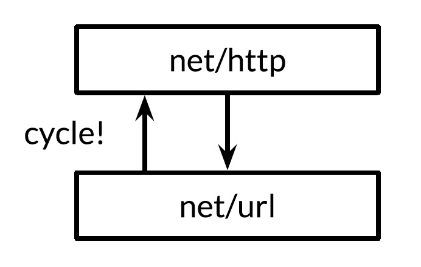
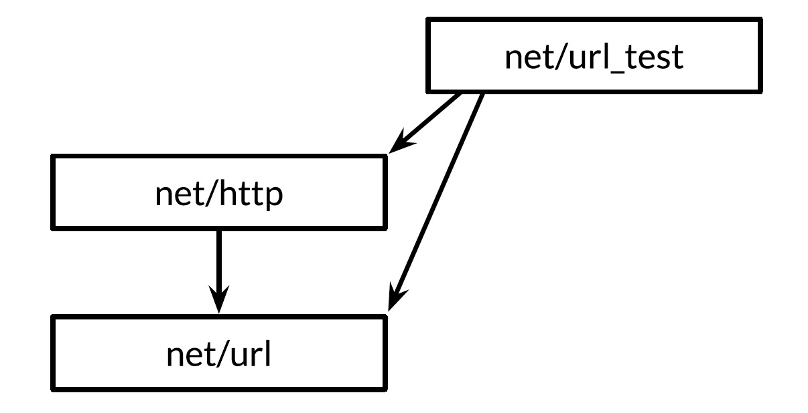

# Testing
- A great deal of effort has been spent on techniques to make the complexity of programs manageable
- 2 techniques in particular stand out for their effectiveness
    1. Routine peer review of programs before they're deployed
    2. Testing
- Go's approach to testing relies on one command, `go test`, and a set of conventions for writing test functions that `go test` can run
    - The comparatively lightweight mechanism is effective for pure testing, and it extends naturally to benchmarks and systematic examples for documentation
- In practice, writing test code is not much different from writing the original programs itself
    - We write short functions that focus on one part of the task
    - We have to be careful of boundary conditions, think about data structures, and reason about what results a computation should produce from suitable inputs
- This is the same process as writing ordinary Go code; it needn't require new notations, conventions, and tools
## The `go test` tool
- The `go test` subcommand is a test driver for Go packages organized according to certain conventions
- In a package directory, files whose name end with `_test.go` are not part of the package ordinarily built by `go build` but are a part of it when built by `go test`
- Within `*_test.go` files, 3 kinds of functions are treated specially: tests, benchmarks, and examples
- A test function, which is a function whose name begins with `Test`, exercises some program logic for correct behavior
    - `go test` calls the test function and reports the result, which is either `PASS` or `FAIL`
- A benchmark function has a name beginning with `Benchmark` and measures the performance of some operation
    - `go test` reports the mean execution time of the operation
- An example function, whose name starts with `Example`, provides machine-checked documentation
- The `go test` tool scans the `*_test.go` files for these special functions, generates a temporary `main` package that calls them all in the proper way, builds and runs it, reports the results, and then clean up

- `go test -v exercises-the_go_programming_language/ch7/eval`
    - `-v` flag lets us see the printed output of the test, which is normally suppressed for a successful test
## `Test` functions
- Each test file must import the `testing` package
- Test functions have the following signature
	
    ```go
    func TestName(t *test.T) { /* ... */ }
    ```

- Test function names must begin with `Test`; the optional suffix `Name` must begin with a capital letter
- The `t` parameter provides methods for reporting test failures and logging additional information
- It's good practice to write the test first and observe that it triggers the same failure described by the bug report. Only then can we be confident that whatever fix we come up with addresses the right problem
    - As a bonus, running `go test` is usually quicker than manually going through the steps described in the bug report, allowing us to iterate more rapidly
- `-v` flag points the name and execution time of each test in the package
- If the test suite contains many slow tests, we may make even faster progress if we're selective about which ones we run. The `-run` flag, whose argument is a regular expression, causes `go test` to run only those tests whose function name matches the pattern (`go test -v -run="French|Canal"`)
- Once we've gotten the selected tests to pass, we should invoke `go test` with no flags to run the entire test suite one last time before we commit the change
- The style of table-driven testing in very common in Go
- The output of a failing test does not include the entire stack trace at the moment of the call to `t.Errorf`. Nor does `t.Errorf` cause a panic or stop the execution of the test
    - Tests are independent of each other. If an early entry in the table causes the test to fail, later table entries will still be checked, and thus we may learn about multiple failures during a single run
- When we really must stop a test function, perhaps because some initialization code failed or to prevent a failure already reported from causing a confusing cascade of others, use `t.Fatal` or `t.Fatalf`
    - These must be called from the same goroutine as the `Test` function, not from another one created during the test
- Test failure messages are usually of the form `"f(x) = y, want z`
    - When convenient, use actual Go syntax for the `f(x)` part
- Avoid boilerplate and redundant information
    - When testing a boolean function, omit the `want z` part since it adds no information
    - If `x`, `y`, or `z` is lengthy, print a concise summary of the relevant parts instead
### Randomized testing
- How to determine the output of a random input
    1. Write an alternative implementation of the function that uses a less efficient but simpler and clearer algorithm, and check that both implementations give the same result
    2. Create input values according to a pattern so that we know what output to expect
- Since randomized tests are nondeterministic, it's critical that the log of the failing test record sufficient information to reproduce the failure
    - For functions that accept complex inputs, it may be simpler toe **log the seed** of the pseudo-random number generator than to dump the entire input data structure. Armed with the seed value, we can easily modify the test to replay the failure deterministically
- By using the current time as a source of randomness, the test will explore novel inputs each time it's run
### Testing a command
- A package named `main` ordinarily produces an executable program, but it can be imported as a library too
    - Although a package name is `main` and it defines a `main` function, during testing this package acts as a library than exposes the function `TestEcho` to the test driver; its `main` function is ignored
- It's important that code being tested not call `log.Fatal` or `os.Exit`, since these will stop the process in its tracks
    - Calling these functions should be regarded as the exclusive right of `main`
- If something totally unexpected happens and a function panics, the test driver will recover, though the test will of course be considered a failure
- Expected errors such as those resulting from bad user input, missing files, or improper configuration should be reported by returning a non-nil `error` value
### White-box testing
- One way to categorizing tests is by the level of knowledge they require of the internal working of the package under test
- A black-box test assumes nothing about the package other than what is exposed by its API and specified by its documentation; the package's internals are opaque
    - Black-box tests are usually more robust, needing fewer updates as the software evolves
    - They also help the test author empathize with the client of the package and can reveal flaws in the API design
- A white-box test has privileged access to the internal functions and data structures of the packages and can make observations and changes that an ordinary client cannot
    - For example, a white-box test can check that the invariants of the package's data types are maintained after every operation
    - White-box tests can provide more detailed coverage of the trickier parts of the implementation
- This pattern (`storage2/storage_test.go`) can be used to temporarily save and restore all kinds of global variables, including command-line flags, debugging options, and performance parameters; to install and remove hooks that cause the production code to call some test code when something interesting happens; and to coax the production code into rare but important states, such as timeouts, errors, and even specific interleavings of concurrent activities
    - Using global variables in this way is safe only because `go test` does not normally run multiple tests concurrently
### External test packages
- Consider the package `net/url`, which provides a URL parser, and `net/http`, which provides a web server and HTTP client library
- The higher-level `new/http` depends on the lower-level `net/url`
- One of the tests in `net/url` is an example demonstrating the interaction between URLs and HTTP client library. In other words, a test of the lower-level package imports the higher-level package
- Declaring this test function in the `net/url` package would create a cycle in the package import path. Go specification forbids import cycles
    
- We resolve the problem by declaring the test function in an **external** test package, that is, in a file in the `net/url` directory whose package declaration reads `package url_test` (would be `package url` normally)
- The extra suffix `_test` is a signal to `go test` that it should build an additional package containing just these files and run its tests
    
    - It may be helpful to think of this external test package as if it had the import path `net/url_test`, but it cannot be imported under this or any other name
- By avoiding import cycles, external test packages allow tests, especially integration tests (which test the interaction of several components), to import other packages freely, exactly as an application would
- We can use the `go list` tool to summarize which Go source files in a package directory are production code, in-package tests, and external tests
	
    ```bash
    # use `fmt` package as an example
    go list -f={{.GoFiles}} fmt
    go list -f={{.TestGoFiles}} fmt # [export_test.go]
    go list -f={{.XTestGoFiles}} fmt
    ```

    - `GoFiles` is the list of files that contain the production code; these are the files that `go build` will include in the application
    - `TestGoFiles` is the list of files that also belong to the `fmt` package, but these files, whose names all end in `_test.go`, are included only when building tests
    - `XTestGoFiles` is the list of files that constitute the external test package, `fmt_test`, so these files must import the `fmt` package on order to use it. They are only included during testing
- Sometimes an external test package may need privileged access to the internals of the package under test, if for example a white-box test must live in a separate package to avoid an import cycle
- In such cases, we use a trick: we add declarations to an in-package `_test.go` file to expose the necessary internals to the external test. This file thus offers the test a back door to the package
    - If the source file exists only for this purpose and contains no tests itself, it's often called `export_test.go`
- The implementation of the `fmt` package needs the functionality of `unicode.IsSpace` as part of `fmt.Scanf`. To avoid creating an undesirable dependency, `fmt` does not import the `unicode` pacakge and its large tables of data; instead, it contains a simpler implementation, which it calls `isSpace`
- To ensure that the behavior of `fmt.isSpace` and `unicode.IsSpace` do not drift apart, `fmt` contains a test. It's an external test, and thus it cannot access `isSpace` directly, so `fmt` opens a back door ot it by declaring an exported variable that holds the internal `isSpace` function. This is the entirety of the `fmt` package's `export_test.go` file
	
    ```go
    # /usr/local/go/src/fmt/export_test.go
    package fmt
    var IsSpace = isSpace
    ```

    - This trick can also be used whenever an external test need to use some of the techniques of white-box testing
### Writing effective tests
- Only once repetitive patterns emerge in a given test suite is it time to introduce abstractions
    - Avoid *premature abstraction*
### Avoid brittle tests
- A test that spuriously fails when a sound change was made to the program is called brittle
- The easiest way to avoid brittle test is to check only the properties you care about
- Test the program's simpler and more stable interfaces in preference to its internal functions
- Be selective in the assertions
    - Don't check for exact string matches, but look for relevant substrings that will remain unchanged as the program evolves
- It's often worth writing a substantial function to distill a complex output down to its essence so that assertions will be reliable
## Coverage
- The degree to which a test suite exercises the package under test is called the test's coverage
- Coverage cannot be quantified directly, but there're heuristics that help us direct the testing effort to where they are more likely to be useful
- Statement coverage is the simplest and most widely used of these heuristics
- The statement coverage of a test suite is the fraction of source statements that are executed at least once during the test
- `ch7/eval`
	
    ```bash
    go test -v -run=Coverage digest_gopl/ch7/eval
    # go tool cover

    go test -run=Coverage -coverprofile=b.out digest_gopl/ch7/eval

    go test -run=Coverage -coverprofile=c.out -covermode=count digest_gopl/ch7/eval
    # process the log and generate an HTML report
    go tool cover -html=c.out
    ```

    - The `go tool` command runs one of the executables from the Go toolchain. These programs live in the directory `$GOROOT/pkg/tool/${GOOS}_${GOARCH}`
    - `-coverprofile` enables the collection of coverage data by instrumenting the production code
        - It modifies a copy of the source so that before each block of statements is executed, a boolean variable is set, with one variable per block
        - Just before the modified program exits, it writes the value of each variable to the specified file `c.out` and prints a summary of the fraction of statement that were executed
        - If all you need is the summary, use `go test -cover`
    - If `go test` is run with the `-covermode=count` flag, the instrumentation for each block increments a counter instead of setting a boolean
        - The resulting log of execution counts of each block enables quantitative comparisons between hotter blocks and colder ones
- Achieving 100% statement coverage sounds like a noble goal, but it's not usually feasible in practice, nor is it likely to be a good use of effort
    - Just because a statement is executed does not mean it's bug-free; statements containing complex expressions must be executed many times with different inputs to cover the interesting cases
    - Some statements, like the `panic` statements above, can never be reached. Others, such as those that handle esoteric errors, are hard to exercise but rarely reached in practice
## Benchmark functions
- Benchmarking is the practice of measuring the performance of a program on a fixed workload
- A benchmark function look like a test function, but with the `Benchmark` prefix and a `*testing.B` parameter that provides most of the same methods as a `*testing.T`, plus a few extra related to performance measurement
    - It also exposes an integer field `N`, that specifies the number of times to perform the operation being measured
    	
        ```go
        // ch11/word2/word_test.go
        func BenchmarkIsPalindrome(b *testing.B) {
            for i := 0; i < b.N; i++ {
                IsPalindrome("A man, a plan, a canal: Panama")
            }
        }
        ```
    
- Unlike tests, by default, no benchmarks are run. The argument to the `-bench` flag selects which benchmarks to run
    - It's a regular expression matching the names of `Benchmark` functions, with a default value that matches none of them
    - `.` pattern causes it to match all benchmarks in the `word` package
- The benchmark name's numeric suffix (`8`) indicates the values of `GOMAXPROCS`, which is important for concurrent benchmarks
- Since the benchmark runner initially has no idea how long the operation takes, it makes some initial measurements using small values of `N` and then extrapolates to a value large enough for a stable timing measurement to be made
- The reason the loop is implemented by the benchmark function, and not by the calling code in the test driver, is so that the benchmark function has the opportunity to execute any necessary one-time setup code outside the loop without this adding to the measured time of each iteration
    - If the setup code is still perturbing the results, the `testing.B` parameter provides methods to stop, resume, and reset the timer, but these are rarely needed
- The fastest program is often the one that makes the fewest memory allocations
- The `-benchmem` will include memory allocation statistics in its report
- Relative timing of 2 different operations
    - If a function takes 1ms to process 1,000 elements, how long will it take to process 10,000 or a million? Such comparisons reveal the asymptotic growth of the running time of the function
    - What's the best size for an I/O buffer? Benchmarks of application throughput over a range of sizes can help us choose the smallest buffer that delivers satisfactory performance
    - Which algorithm performs best for a given job? Benchmarks that evaluate 2 different algorithms on the same input data can often show the strengths and weaknesses of each one on important or representative workloads
- Comparative benchmarks are just regular code. They typically take the form of a single parameterized function, called from several `Benchmark` functions with different values
	
    ```go
    func benchmark(b *testing.B, size int) { /*  */ }
    func Benchmark10(b *testing.B) { benchmark(b, 10) }
    func Benchmark10000(b *testing.B) { benchmark(b, 10000) }
    ```

    - Resist the temptation to use the parameter `b.N` as the input size. Unless you interpret it as an iteration count for a fixed-size input, the results of your benchmark will be meaningless
- Patterns revealed by comparative benchmarks are particularly useful during program design, but we don't throw the benchmarks away when the program is working
    - As the program evolves, or its inputs grows, or it's deployed on new operating systems or processors with different characteristics, we can reuse those benchmarks to revisit design decisions
## Profiling
- When we wish to look carefully at the speed of our programs, the best technique for identifying the critical code is *profiling*
- Profiling is an automated approach to performance measurement based on sampling a number of profile events during execution, then extrapolating from them during a post-process step; the resulting statistical summary is called a profile
- Go supports many kinds of profiling, each concerned with a different aspect of performance, but all of them involve recording a sequence of events of interest, each of which has an accompanying stack trace - the stack of function calls active at the moment of the event
- The `go test` tool has built-in support for several kinds of profiling
- A CPU profile identifies the functions whose execution requires the most CPU time
    - The currently running thread on each CPU is interrupted periodically by the operating system every milliseconds, with each interruption recording one profile event before normal execution resumes
- A heap profile identifies the statements responsible for allocating the most memory
    - The profiling library samples calls to the internal memory allocation routines so that on average, one profile event is recorded per 512KB of allocated memory
- A blocking profile identifies the operations responsible for blocking goroutines the longest, such as system calls, channel sends and receives, and acquisitions of locks
    - The profiling library records an event every time a goroutine is blocked by one of these operations
- Gathering a profile for code under test is as easy as enabling one of the flags below
	
    ```bash
    go test -cpuprofile=cpu.out
    go test -blockprofile=block.out
    go test -memprofile=mem.out
    ```

    - Be careful when using more than 1 flag at a time: the machinery for gathering 1 kind of profile may skew the results of others
- It's easy add profiling support to non-test programs too, though the details of how we do that vary between short-lived command-line tools and long-running server applications
    - Profiling is especially useful in long-running applications, so the Go's runtime's profiling features can be enabled under programmer control under the `runtime` API
- Once we've gathered a profile, we need to analyze it using the `pprof` tool
    - This is part of the Go distribution, but since it's not an everyday tool, it's accessed indirectly using `go tool pprof`
    - It has dozens of features and options, but basic use requires only 2 arguments, the executable that produced the profile and the profile log
- To make profiling efficient and to save space, the log does not include function names; instead, functions are identified by their addresses
    - This means that `pprof` needs the executable in order to make sense of the log
    - Although `go test` usually discards the test executable once the test is complete, when profiling is enabled, it saves the executable as `foo.test`, where `foo` is the name of the tested package
- Gather and display s simple CPU profile
	
    ```bash
    go test -run=NONE -bench=ClientServerParallelTLS64 -cpuprofile=cpu.log net/http
    go tool pprof -text -nodecount=10 ./http.test cpu.log
    ```

    - It's usually better to profile specific benchmarks that have been constructed to be representative of workloads one cares about
    - Benchmarking test cases is almost never representative, which is why we disabled them by using the filter `-run=NONE`
    - The `-text` flag specifies the output format, in this case, a textual table with one row per function, sorted so the hottest functions appear first
    - The `-nodecount=10` limits the results to 10 rows
    - For more subtle problems, you may better off using one of `pprof`'s graphical displays
        - These require [GraphViz](http://www.graphviz.org/)
        - The `-web` flag then renders a directed graph of the functions of the program, annotated by their CPU profile numbers and colored to indicate the hottest functions
- https://blog.golang.org/profiling-go-programs
## Example functions
- The third kind of function treated specially be `go test` is an example function, one whose name starts with `Example`
- It has neither parameters nor results
	
    ```go
    func ExampleIsPalindrome() {
        fmt.Println(IsPalindrome("A man, a plan, a canal: Panama"))
        fmt.Println(IsPalindrome("palindrome"))
        // Output:
        // true
        // false
    }
    ```

- Example functions serve 3 purposes
    1. Documentation (primary)
        - A good example can be a more succinct or intuitive way to convey the behavior of a library function than its prose description, especially when used as a reminder or quick reference
        - An example can also demonstrate the interaction between several types and functions belonging to one API, whereas prose documentation must always be attached to one place, like a type or function declaration or the package as a whole
        - And unlike examples within comments, example functions are real Go code, subject to compile-time checking, so they don't become stale as the code evolves
        - Base on the suffix of the `Example` function, the web-based documentation server `godoc` associates example function with the function or package they exemplify
            - So `ExampleIsPalindrome` would be shown with the documentation for the `IsPalindrome` function, and an example function called just `Example` would be associated with the `word` package as a whole
    2. Examples are executable tests run by `go test`
        - If the example function contains a final `// Output:` comment, the test driver will execute the function and check that what it printed to its standard output matches the text within the comment
    3. An example is hands-on experimentation
        - The `godoc` server at `golang.org` uses the Go Playground to let the user edit and run each example function from within a web browser
        - This is often the fastest way to get a feel for a particular function or language feature